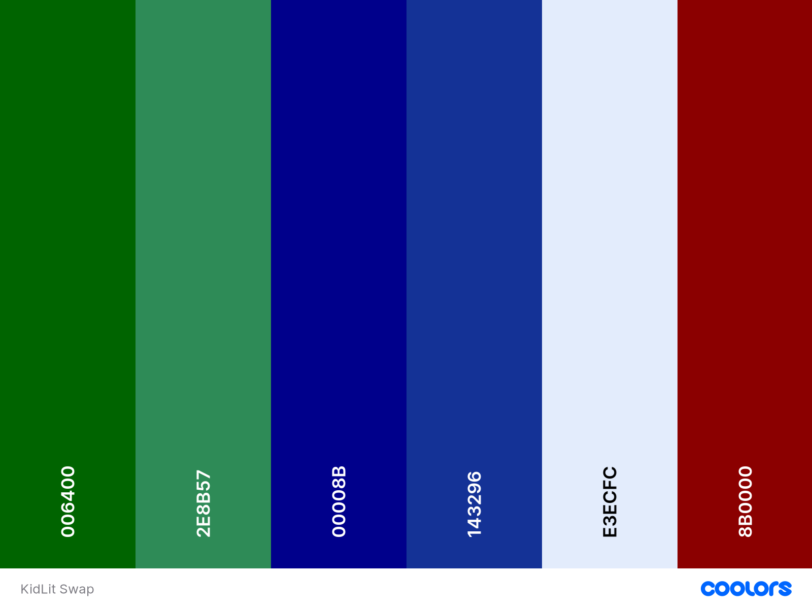

# KidLit Swap

KidLit Swap, derived from Kids' Literature Swap, is a vibrant online community where parents unite to share and exchange children's books. Originating from conversations among parents at my kids' school, it serves as a virtual clubhouse celebrating the enchantment of storytelling in the digital era.

KidLit Swap's purpose is clear – to encourage the sharing and borrowing of kids' literature, fostering a love for reading in young minds. You can share your favorite stories, borrow books from others, and be part of our growing library. It's a fun way to help your kids become great readers.

Join KidLit Swap and let's make reading magical for our little ones!

[KidLit Swap Live Page](https://kidlit-swap-96ca222a1195.herokuapp.com/)

## CONTENTS

- [KidLit Swap](#kidlit-swap)
  - [CONTENTS](#contents)
  - [Project Goals](#project-goals)
  - [User Experience (UX)](#user-experience-ux)
    - [Target Audience](#target-audience)
    - [User Requeriments and Expectations](#user-requeriments-and-expectations)
    - [User Stories](#user-stories)
      - [First Time Visitor Goals](#first-time-visitor-goals)
      - [Returning Visitor Goals](#returning-visitor-goals)
      - [Frequent Visitor Goals](#frequent-visitor-goals)
      - [Scope](#scope)
  - [Design](#design)
    - [Color Scheme](#color-scheme)
    - [Imagery](#imagery)
    - [Typography](#typography)
    - [Wireframes](#wireframes)
  - [Agile Methodology](#agile-methodology)
  - [Data Model](#data-model)
  - [Security Features and Defensive Design](#security-features-and-defensive-design)
    - [User Authentication](#user-authentication)
    - [Form Validation](#form-validation)
    - [Database Security](#database-security)
    - [Custom error pages:](#custom-error-pages)
  - [Features](#features)
    - [Existing Features](#existing-features)
      - [Favicon](#favicon)
      - [Header](#header)
      - [Footer](#footer)
    - [Home Page](#home-page)
    - [User Account Pages](#user-account-pages)
    - [Error Pages](#error-pages)
    - [Future Implementations](#future-implementations)
  - [Technologies Used](#technologies-used)
    - [Languages Used](#languages-used)
    - [Frameworks, Libraries \& Programs Used](#frameworks-libraries--programs-used)
  - [Testing](#testing)
    - [Bugs](#bugs)
  - [Deployment](#deployment)
    - [Code Institute Python Essentials Template](#code-institute-python-essentials-template)
    - [Deployment process](#deployment-process)
    - [Local Development](#local-development)
      - [How to Fork](#how-to-fork)
      - [How to Clone](#how-to-clone)
  - [Credits](#credits)
    - [Code](#code)
    - [Content](#content)
    - [Media](#media)
  - [Acknowledgments](#acknowledgments)

---

## Project Goals

The KidLit Swap project was developed with the following goals in mind:

1. Create Account & Log In: Easily set up an account and log in to access KidLit Swap's vibrant community.
   
2. Add Books: Share your favorite children's books by adding them to our virtual library.
   
3. Check Book Details: Explore detailed information about each book to find the perfect story for your child.

4. Borrow Books: Borrow books from other parents, promoting a sense of community and sharing.

5. Select Return Date: Choose a return date that suits you, making the borrowing process flexible and convenient.

6. Return Borrowed Books: Easily return the books you've borrowed, ensuring a smooth exchange process.

7. Log Out: Safely log out when you're done, knowing your account is secure.

KidLit Swap aims to create a welcoming space for parents to share children's books, fostering a love for reading, and simplifying the process of swapping stories to make it both enjoyable and easy.

[Back to Contents](#contents)

---

## User Experience (UX)

### Target Audience

KidLit Swap is designed to cater to the following target audience:

- Parents and Families: Looking for an easy way to share and borrow children's books.

- Kids' Book Fans: Those who love children's literature and want to be part of a sharing community.

- Story Lovers: People who enjoy stories and want to make reading fun for kids.

- Community-minded Individuals: Anyone who likes connecting with others, sharing stories, and being part of a cheerful community focused on children's books.

### User Requeriments and Expectations

- **User Requirements:** KidLit Swap caters to users who seek a straightforward platform to effortlessly share and borrow children's books. Whether parents, kids' book enthusiasts, or community-minded individuals, the requirement is a love for children's literature and a desire to be part of a collaborative reading space.

- **User Expectations:** Users can anticipate a user-friendly platform that simplifies the process of sharing and borrowing children's books. The interface is designed to be intuitive, making book exchange enjoyable and stress-free. Expect a welcoming community and a growing library of diverse children's literature, fostering a love for reading in a fun and engaging way.

### User Stories

#### First Time Visitor Goals

As a first-time visitor to KidLit Swap, I aim to:

- Understand KidLit Swap's purpose: Learn how to navigate the platform, create an account, and add books.

- Explore diverse book categories: Find and choose books that align with your children's interests or personal preferences.

- Experience a user-friendly interface: Engage with an intuitive and interactive platform that simplifies the process of sharing and borrowing children's books.

#### Returning Visitor Goals

As a returning visitor to KidLit Swap, I aim to:

- Easily log in to my account and access my added books, borrow new books, and check the status of my borrowed books.

- Discover newly added books or categories since my last visit, enhancing my book-sharing experience.

- Explore and contribute to the growing community by adding more books, fostering a collaborative space for children's literature enthusiasts.

#### Frequent Visitor Goals

As a frequent visitor to KidLit Swap, my goals include:

- Seamlessly navigate the platform, utilizing advanced features for efficient book sharing and borrowing.

- Regularly contribute to the community by adding new books, and fostering a dynamic exchange of children's literature.

#### Scope

KidLit Swap aims to provide an accessible and engaging platform where users can seamlessly explore, share, and connect over a diverse collection of children's books. The development process will be guided by several EPIC stories, each addressing specific aspects of the platform. Key features will include:

1.  [EPIC - Mentor Sessions: Code Institute PP4](https://github.com/IzabellaLopes/kidlit-swap/milestone/1)
   - **USER STORY: Mentor Session 1: Project Planning [#1](https://github.com/IzabellaLopes/kidlit-swap/issues/1)** - As a Developer I can discuss with my mentor the concept study for my PP4 at Code Institute so that I receive valuable guidance and insights for my project
   - **USER STORY: Mentor Session 2: Mid-Point Project Review [#3](https://github.com/IzabellaLopes/kidlit-swap/issues/3)** - As a Developer I can share the progress of my PP4 with my mentor so that I can obtain valuable feedback and guidance for the remaining phases of the project
   - **USER STORY: Mentor Session 3: Final Project Review [#4](https://github.com/IzabellaLopes/kidlit-swap/issues/4)** - As a Developer I can showcase the completed project and near-complete documentation so that I can receive valuable mentor feedback

2.  [EPIC - Initial Set Up](https://github.com/IzabellaLopes/kidlit-swap/milestone/2)
   - **USER STORY: Initial Django Set Up [#6](https://github.com/IzabellaLopes/kidlit-swap/issues/6)** - As a Developer I can set up a new Django project so that I can create the project's structure
   - **USER STORY: Connect Database and Cloudinary Storage [#7](https://github.com/IzabellaLopes/kidlit-swap/issues/7)** - As a Developer I can connect the database and media storage so that the user's stored data is managed successfully
   - **USER STORY: Initial Heroku Deployment [#8](https://github.com/IzabellaLopes/kidlit-swap/issues/8)** - As a Developer I can perform an early deployment of the application to verify the functionality of the initial set up so that I can continue testing the application as it evolves during development

3.  [EPIC: User Experience (UX) Design](https://github.com/IzabellaLopes/kidlit-swap/milestone/3)
   - **USER STORY: Implement Responsive Layout [#12](https://github.com/IzabellaLopes/kidlit-swap/issues/12)** - As a Developer I can optimize KidLit Swap's layout for responsiveness so that ensure a seamless and enjoyable browsing experience across diverse devices for users accessing the KidLit Swap website
   - **USER STORY: UX/UI Theming and Styling Enhancement [#14](https://github.com/IzabellaLopes/kidlit-swap/issues/14)** - As a Developer I can refine the UX/UI theming and styling of KidLit Swap so that I create an engaging and child-friendly visual experience within the kids' book library

4.  [EPIC: Book Management System](https://github.com/IzabellaLopes/kidlit-swap/milestone/4)
   - **USER STORY: Add a New Book [#16](https://github.com/IzabellaLopes/kidlit-swap/issues/16)** - As a User / Admin I can add a new book to the system so that I can easily expand the library's collection
   - **USER STORY: View a List of All Books [#17](https://github.com/IzabellaLopes/kidlit-swap/issues/17)** - As a User / Admin I can view a list of all books in the system so that I can easily manage and monitor the library's inventory
   - **USER STORY: View Book Details [#21](https://github.com/IzabellaLopes/kidlit-swap/issues/21)** - As a User / Admin I can view details of a specific book so that I can get comprehensive information about a particular book
   - **USER STORY: Edit Book Details [#18](https://github.com/IzabellaLopes/kidlit-swap/issues/18)** - As a User / Admin I can edit the details of an existing book so that I can keep the information accurate and up-to-date
   - **USER STORY: Borrow a Book [#19](https://github.com/IzabellaLopes/kidlit-swap/issues/19)** - As a User / Admin I can mark a book as "Borrowed" and set a return date so that I can facilitate and track book borrowings
   - **USER STORY: Mark Book as Returned [#20](https://github.com/IzabellaLopes/kidlit-swap/issues/20)** - As a User / Admin I can mark a borrowed book as "Returned" so that I can update the library's inventory and track book returns

5.  [EPIC: User Authentication](https://github.com/IzabellaLopes/kidlit-swap/milestone/5)
   - **USER STORY: Log In [#23](https://github.com/IzabellaLopes/kidlit-swap/issues/23)** - As a User I can log in so that I can access personalized features and participate in the KidLit Swap community
   - **USER STORY: Log Out [#24](https://github.com/IzabellaLopes/kidlit-swap/issues/24)** - As a User I can log out so that I can secure my account and maintain privacy
   - **USER STORY: Sign Up [#25](https://github.com/IzabellaLopes/kidlit-swap/issues/25)** - As a User I can sign up so that I can become a member of the KidLit Swap community and share my love for children's literature
   - **USER STORY: Profile Page Edit [#26](https://github.com/IzabellaLopes/kidlit-swap/issues/26)** - As a User I can edit my profile page so that I can update my information and preferences within the KidLit Swap community
   - **USER STORY: Account Deletion [#27](https://github.com/IzabellaLopes/kidlit-swap/issues/27)** - As a User I can delete my account so that I can permanently leave the KidLit Swap community if needed

6.  [EPIC: Documentation](https://github.com/IzabellaLopes/kidlit-swap/milestone/6)
   - **Documentation [#28](https://github.com/IzabellaLopes/kidlit-swap/issues/28)** - Comprehensive documentation outlines the essential aspects and purposes of the application
   - **Code Documentation [#29](https://github.com/IzabellaLopes/kidlit-swap/issues/29)** - Code documentation of each function/class and module is written for easy legibility/understanding

7. [EPIC: Future Features](https://github.com/IzabellaLopes/kidlit-swap/milestone/7)
- This milestone centers on the ongoing enhancement and maintenance of KidLit Swap, specifically prioritizing the integration of upcoming features. Some user stories have been excluded from the current project scope due to time constraints and have been labeled as "Won't Have" on the GitHub project board. The intention is to implement these user stories at a later date.
  

[Back to Contents](#contents)

---

## Design

KidLit Swap's design is intentionally crafted to be simple and clean, ensuring a user-friendly virtual library for sharing children's books and creating an enjoyable experience.

### Color Scheme

The color scheme for KidLit Swap features lively shades of green, blue, and red, creating a vibrant and playful atmosphere for the children's literature-sharing website. 

In my CSS file, I employed variables to define colors and consistently applied them across the entire stylesheet. It enables easy color updates throughout the website by modifying the color once in the variable, maintaining consistency across the design.

Great care was taken to establish a good contrast between background colors and text at all times to ensure maximum user accessibility, confirmed through the [WebAIM Contrast Checker](https://webaim.org/resources/contrastchecker/).

The color palette was generated using the [Coolors](https://coolors.co/) website.

### Imagery

The images utilized in KidLit Swap were generated by [Lexica Art](https://lexica.art/) and sourced from [Oxford Owl](https://www.oxfordowl.co.uk/). Additionally, users will be able to upload their own images for their respective books. Moreover, I created the logo using [Canva](https://www.canva.com/). Credits for the images can be found in the "Credits" section.

### Typography

In KidLit Swap, the following fonts, obtained from Google Fonts, were carefully chosen to enhance the overall visual appeal:

- [Potta One](https://fonts.google.com/?preview.text=KidLit%20Swap&query=potta+one) for Header:
  - Cursive font
  - Provides a playful and inviting feel, catering to a kid-friendly atmosphere.

- [Shantell Sans](https://fonts.google.com/?preview.text=KidLit%20Swap&query=Shantell+Sans) for Content:
  - Sans-serif font
  - A clean and elegant font, contributing to a pleasant reading experience, maintaining a friendly and playful tone throughout the platform.

These font choices, with a focus on being kid-friendly and playful, aim to create a visually appealing and enjoyable interface for users engaging with KidLit Swap.

### Wireframes

I utilized Balsamiq to design the wireframes for the website.

 
Home Page - User Not Logged In

 
Home Page - User Logged In

 
Book List

 
Book Details

 
My Books

 
Add Books

 
Profile

 
Sign Up

 
Log In

 

[Back to Contents](#contents)

---

## Agile Methodology

GitHub Projects was utilized to facilitate the development process following an agile methodology. You can refer to the project board through this [link](https://github.com/users/IzabellaLopes/projects/2).

The 7 Epics mentioned earlier were documented as Milestones within the GitHub project. Each User Story was represented by a GitHub Issue, which was subsequently assigned to a milestone (Epic). Clear acceptance criteria were defined for each User Story to indicate when it is considered complete. Furthermore, these acceptance criteria were detailed into tasks, streamlining the execution of each User Story.

[Back to Contents](#contents)

---

## Data Model

I used principles of Object-Oriented Programming throughout this project and Django’s Class-Based Generic Views.  

Django AllAuth was used for the user authentication system.

The diagram below details the database schema.

[Back to Contents](#contents)

---

## Security Features and Defensive Design

### User Authentication

### Form Validation

### Database Security

### Custom error pages:

Custom Error Pages were created to give the user more information on the error and to provide them with buttons to guide them back to the site.

- 400 Bad Request - The KidLit Swap is unable to handle this request.
- 403 Page Forbidden - Looks like you're trying to access forbidden content. Please log out and sign in to the correct account.
- 404 Page Not Found - The page you're looking for doesn't exist.
- 500 Server Error - The KidLit Swap is currently unable to handle this request

[Back to Contents](#contents)

---

## Features

### Existing Features

#### Favicon

The website features a favicon that is visible in the browser tab.

#### Header

**Logo**

**Navigation Bar**

#### Footer

### Home Page

### User Account Pages

**Sign Up**

**Log In**

**Log Out**

### Error Pages

Custom Error Pages were created to give the user more information on the error and to guide them back to the site.

- 400 Bad Request - The Easy Eater is unable to handle this request.
- 403 Page Forbidden - Looks like you're trying to access forbidden content. Please log out and sign in to the correct account.
- 404 Page Not Found - The page you're looking for doesn't exist.
- 500 Server Error - The Easy Eater is currently unable to handle this request

### Future Implementations

The following user stories were scoped out of the project due to time constraints and labelled as "Could Have" on the project board in Github. It is intended that these user stories will be implemented at a later date. 

[Back to Contents](#contents)

---

## Technologies Used

### Languages Used

- Python
- HTML
- CSS
- Javascript

### Frameworks, Libraries & Programs Used

- [VS Code](https://code.visualstudio.com/) - IDE used to create the KidLit Swap.
- [Github](https://github.com/) - Used for file storage, version control, and agile tool.
- [Heroku](https://www.heroku.com/) - Used to deploy the project.
- [Django](https://www.djangoproject.com/) - Main python framework used in the development of this project.
- [Django-allauth](https://django-allauth.readthedocs.io/en/latest/installation.html) - Authentication library used to create the user accounts.
- [PostgreSQL](https://www.postgresql.org/) - Used as the database for this project.
- [Balsamiq](https://balsamiq.com/) - Used to generate Wireframes.
- [Coolors](https://coolors.co/) - Used to create color palette.
- [Google Fonts](https://fonts.google.com/) - Used to import and alter fonts on the page.
- [WebAIM Contrast Checker](https://webaim.org/resources/contrastchecker/) - Used to check contrast.
- [Canva](https://www.canva.com/) - To create the logo.

include:
- [Code Institute Python Essentials Template](https://github.com/Code-Institute-Org/python-essentials-template) - Served as the foundational structure for this project.

- [Code Institute Python Linter](https://pep8ci.herokuapp.com/) - Verify code conformity with PEP8.

- [Pylance Validator](https://marketplace.visualstudio.com/items?itemName=ms-python.vscode-pylance)
  

- [TinyPNG](https://tinypng.com/) - To compress images

- [CloudConvert](https://cloudconvert.com/) - To transform a video into a GIF for inclusion in the Readme.md file.

- [Favicon.io](https://favicon.io/) - To create favicon.

- [Chat-GPT](https://chat.openai.com/) - Enhance Readme.md readability; streamline content for effective communication.

- [Responsinator](http://www.responsinator.com/) - Used to verify responsiveness of website on different devices.
- [Chrome Dev Tools](https://developer.chrome.com/docs/devtools/) - Used for overall development and tweaking, including testing responsiveness and performance.
- [Font Awesome](https://fontawesome.com/) - Used for icons in information bar.
- [W3C](https://www.w3.org/) - Used for HTML & CSS Validation.
- [PEP8 Online](http://pep8online.com/) - used to validate all the Python code
- [Jshint](https://jshint.com/) - used to validate javascript
- [Favicon](https://favicon.io/) - Used to create the favicon.
- [Lucidchart](https://lucid.app/documents#/dashboard) - used to create the database schema design
- [Grammerly](https://app.grammarly.com/) - used to proof read the README.md
- [Summernote](https://summernote.org/): A WYSIWYG editor to allow users to edit their posts
- [Techsini](https://techsini.com/multi-mockup/index.php) - Site mockup generator
- [Crispy Forms](https://django-crispy-forms.readthedocs.io/en/latest/) used to manage Django Forms
- [Cloudinary](https://cloudinary.com/): the image hosting service used to upload images
- [Bootstrap 4.6](https://getbootstrap.com/docs/4.6/getting-started/introduction/): CSS Framework for developing responsiveness and styling
- [Tables Generator](https://www.tablesgenerator.com/markdown_tables): Used to convert excel testing tables to markdown

- [Google Developer Tools](https://developers.google.com/web/tools) - To troubleshoot and test features, resolve issues related to responsiveness and styling.

- [TinyPNG](https://tinypng.com/) To compress images

- [Safeimagekit](https://safeimagekit.com/) To resize images and convert them to the webp format.

- [Ezgif](https://ezgif.com/video-to-gif/) To convert video to gif to include in the Readme.md.

- [Font Awesome](https://fontawesome.com/) - For the iconography on the website.

- [Favicon.io](https://favicon.io/) To create favicon.

- [Am I Responsive?](http://ami.responsivedesign.is/) To display the website image across various devices.

- [Web Disability Simulator](https://chrome.google.com/webstore/detail/web-disability-simulator/olioanlbgbpmdlgjnnampnnlohigkjla) - A Google Chrome extension that allows you to view your site as people with accessibility needs would see it.

- [Webpage Spell-Check](https://chrome.google.com/webstore/detail/webpage-spell-check/mgdhaoimpabdhmacaclbbjddhngchjik/related) - a google chrome extension that allows you to spell check your webpage. Used to check the site and the readme for spelling errors.

[Back to Contents](#contents)

---

## Testing

Please refer to [TESTING.md](TESTING.md) file for a comprehensive overview of all conducted testing procedures.

### Bugs

| **BUG** | **DESCRIBE THE BUG**  | **HOW I SOLVED**|
| ------- | ------- | ------- |

[Back to Contents](#contents)

---

## Deployment 

The website has been successfully deployed on Heroku. You can access the live site [here](https://kidlit-swap-96ca222a1195.herokuapp.com/).

### Code Institute Python Essentials Template 

To create a terminal-based user interface using the Code Institute Python Essentials Template and display Python code output:

1. Go to the [Code Institute Essentials Template](https://github.com/Code-Institute-Org/python-essentials-template) and click on "Use this template."
2. Choose "Create a new repository."

### Deployment process

Vide Txt

### Local Development

#### How to Fork

To fork the repository:

1. Login (or signup) to GitHub account.
2. Go to the repository for this project, [IzabellaLopes/kidlit-swap](https://github.com/IzabellaLopes/kidlit-swap).
3. Click the Fork button in the top right corner.
4. Edit the repository name and description if desired
4. Click the green create fork button

#### How to Clone

To clone the repository:

1. Login (or signup) to GitHub account.
2. Go to the repository for this project, [IzabellaLopes/kidlit-swap](https://github.com/IzabellaLopes/kidlit-swap).
3. Click on the code button, select whether you would like to clone with HTTPS, SSH or GitHub CLI and copy the link shown.
4. Open the terminal in your code editor and change the current working directory to the location you want to use for the cloned directory.
5. Type 'git clone' into the terminal and then paste the link you copied in step 3. Press enter.

[Back to Contents](#contents)

---

## Credits

- [W3Schools](https://www.w3schools.com/)
- [Django Docs](https://docs.djangoproject.com/en/4.0/)
- [Bootstrap 4.6 Docs](https://getbootstrap.com/docs/4.6/getting-started/introduction/)
- [Stack Overflow](https://stackoverflow.com/)
- [Update View](https://pytutorial.com/django-updateview-example)
- [Pagination](https://docs.djangoproject.com/en/2.2/topics/pagination/#using-paginator-in-a-view)
- [AutoSlugField](https://django-extensions.readthedocs.io/en/latest/field_extensions.html)
- [Code Institute - Blog Walkthrough Project](https://github.com/Code-Institute-Solutions/Django3blog)

### Code

### Content

- Content for the website was written by Izabella Lopes.

### Media

Include credits for Imagery
[Lexica Art](https://lexica.art/)
[Oxford Owl](https://www.oxfordowl.co.uk/)
[Canva](https://www.canva.com/)

## Acknowledgments

I would like to express my gratitude to the following individuals who played significant roles in the successful completion of my fourth project:

- I am grateful to my family for their consistent support and understanding throughout this period of intense studying.
- I want to express my sincere thanks to my fellow peers from the April 2023 cohort at Code Institute. Their invaluable contributions in bug testing are deeply appreciated.
- Jubril Akolade, my mentor from the Code Institute.