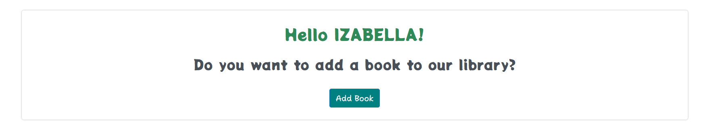
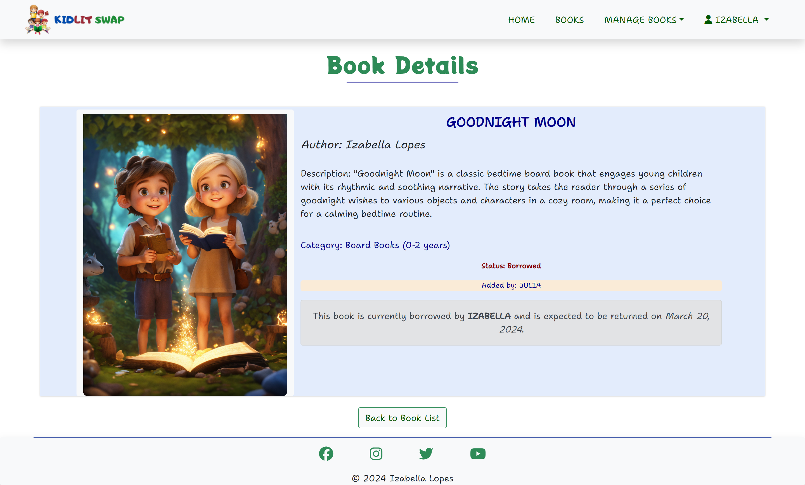
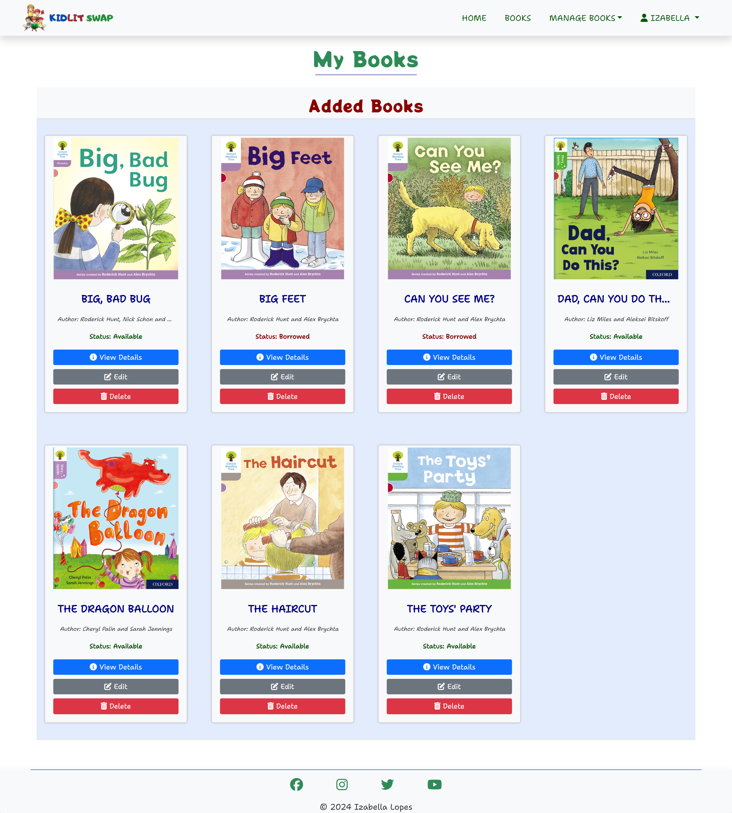

# KidLit Swap

KidLit Swap, derived from Kids' Literature Swap, is a vibrant online community where parents unite to share and exchange children's books. 

Originating from conversations among parents at my kids' school, it serves as a virtual clubhouse celebrating the enchantment of storytelling in the digital era. Our initial concept involves gathering every first Saturday of the month at the school to kick off our tradition of swapping children's books. Soon, I plan to introduce a feature where the book's owner will be notified about a loan request and can coordinate a convenient location and time for both parties.

KidLit Swap's purpose is clear – to encourage the sharing and borrowing of kids' literature, fostering a love for reading in young minds. You can share your favorite stories, borrow books from others, and be part of our growing library. It's a fun way to help your kids become great readers.

Join KidLit Swap and let's make reading magical for our little ones!

[KidLit Swap Live Page](https://kidlit-swap-96ca222a1195.herokuapp.com/)

## CONTENTS

- [KidLit Swap](#kidlit-swap)
  - [CONTENTS](#contents)
  - [Project Goals](#project-goals)
  - [User Experience (UX)](#user-experience-ux)
    - [Target Audience](#target-audience)
    - [User Requeriments and Expectations](#user-requeriments-and-expectations)
    - [User Stories](#user-stories)
      - [First Time Visitor Goals](#first-time-visitor-goals)
      - [Returning Visitor Goals](#returning-visitor-goals)
      - [Frequent Visitor Goals](#frequent-visitor-goals)
      - [Scope](#scope)
  - [Design](#design)
    - [Color Scheme](#color-scheme)
    - [Imagery](#imagery)
    - [Typography](#typography)
    - [Wireframes](#wireframes)
  - [Agile Methodology](#agile-methodology)
  - [Data Model](#data-model)
  - [Security Features and Defensive Design](#security-features-and-defensive-design)
    - [User Authentication](#user-authentication)
    - [Form Validation](#form-validation)
    - [Database Security](#database-security)
    - [Cross-Site Request Forgery (CSRF) Protection](#cross-site-request-forgery-csrf-protection)
    - [Custom Error Pages](#custom-error-pages)
  - [Features](#features)
    - [Existing Features](#existing-features)
      - [Favicon](#favicon)
      - [Header](#header)
      - [Footer](#footer)
    - [Home Page](#home-page)
      - [Hero Call-to-Action section](#hero-call-to-action-section)
      - [About section](#about-section)
    - [User Account Pages](#user-account-pages)
      - [Sign Up](#sign-up)
      - [Log In](#log-in)
      - [Log Out](#log-out)
    - [Book List](#book-list)
    - [Book Details](#book-details)
    - [Category](#category)
    - [Manage Books | My Books](#manage-books--my-books)
    - [Manage Books | Borrowed Books](#manage-books--borrowed-books)
    - [Manage Books | Add Book](#manage-books--add-book)
    - [Profile](#profile)
    - [Error Pages](#error-pages)
    - [Future Implementations](#future-implementations)
  - [Technologies Used](#technologies-used)
    - [Languages Used](#languages-used)
    - [Frameworks - Libraries - Programs Used](#frameworks---libraries---programs-used)
  - [Testing](#testing)
  - [Deployment](#deployment)
    - [Code Institute Template](#code-institute-template)
    - [Deployment process](#deployment-process)
    - [Local Development](#local-development)
      - [How to Fork](#how-to-fork)
      - [How to Clone](#how-to-clone)
  - [Credits](#credits)
    - [Code](#code)
    - [Content](#content)
    - [Media](#media)
  - [Acknowledgments](#acknowledgments)

---

## Project Goals

The KidLit Swap project was developed with the following goals in mind:

1. Create Account & Log In: Easily set up an account and log in to access KidLit Swap's vibrant community.
   
2. Add Books: Share your favorite children's books by adding them to our virtual library.
   
3. Check Book Details: Explore detailed information about each book to find the perfect story for your child.

4. Borrow Books: Borrow books from other parents, promoting a sense of community and sharing.

5. Select Return Date: Choose a return date that suits you, making the borrowing process flexible and convenient.

6. Return Borrowed Books: Easily return the books you've borrowed, ensuring a smooth exchange process.

7. Log Out: Safely log out when you're done, knowing your account is secure.

KidLit Swap aims to create a welcoming space for parents to share children's books, fostering a love for reading, and simplifying the process of swapping stories to make it both enjoyable and easy.

[Back to Contents](#contents)

---

## User Experience (UX)

### Target Audience

KidLit Swap is designed to cater to the following target audience:

- Parents and Families: Looking for an easy way to share and borrow children's books.

- Kids' Book Fans: Those who love children's literature and want to be part of a sharing community.

- Story Lovers: People who enjoy stories and want to make reading fun for kids.

- Community-minded Individuals: Anyone who likes connecting with others, sharing stories, and being part of a cheerful community focused on children's books.

### User Requeriments and Expectations

- **User Requirements:** KidLit Swap caters to users who seek a straightforward platform to effortlessly share and borrow children's books. Whether parents, kids' book enthusiasts, or community-minded individuals, the requirement is a love for children's literature and a desire to be part of a collaborative reading space.

- **User Expectations:** Users can anticipate a user-friendly platform that simplifies the process of sharing and borrowing children's books. The interface is designed to be intuitive, making book exchange enjoyable and stress-free. Expect a welcoming community and a growing library of diverse children's literature, fostering a love for reading in a fun and engaging way.

### User Stories

#### First Time Visitor Goals

As a first-time visitor to KidLit Swap, I aim to:

- Understand KidLit Swap's purpose: Learn how to navigate the platform, create an account, and add books.

- Explore diverse book categories: Find and choose books that align with your children's interests or personal preferences.

- Experience a user-friendly interface: Engage with an intuitive and interactive platform that simplifies the process of sharing and borrowing children's books.

#### Returning Visitor Goals

As a returning visitor to KidLit Swap, I aim to:

- Easily log in to my account and access my added books, borrow new books, and check the status of my borrowed books.

- Discover newly added books or categories since my last visit, enhancing my book-sharing experience.

- Explore and contribute to the growing community by adding more books, fostering a collaborative space for children's literature enthusiasts.

#### Frequent Visitor Goals

As a frequent visitor to KidLit Swap, my goals include:

- Seamlessly navigate the platform, utilizing advanced features for efficient book sharing and borrowing.

- Regularly contribute to the community by adding new books, and fostering a dynamic exchange of children's literature.

#### Scope

KidLit Swap aims to provide an accessible and engaging platform where users can seamlessly explore, share, and connect over a diverse collection of children's books. The development process will be guided by several EPIC stories, each addressing specific aspects of the platform. Key features will include:

1.  [EPIC - Mentor Sessions: Code Institute PP4](https://github.com/IzabellaLopes/kidlit-swap/milestone/1)
   - **USER STORY: Mentor Session 1: Project Planning [#1](https://github.com/IzabellaLopes/kidlit-swap/issues/1)** - As a Developer I can discuss with my mentor the concept study for my PP4 at Code Institute so that I receive valuable guidance and insights for my project
   - **USER STORY: Mentor Session 2: Mid-Point Project Review [#3](https://github.com/IzabellaLopes/kidlit-swap/issues/3)** - As a Developer I can share the progress of my PP4 with my mentor so that I can obtain valuable feedback and guidance for the remaining phases of the project
   - **USER STORY: Mentor Session 3: Final Project Review [#4](https://github.com/IzabellaLopes/kidlit-swap/issues/4)** - As a Developer I can showcase the completed project and near-complete documentation so that I can receive valuable mentor feedback

2.  [EPIC - Initial Set Up](https://github.com/IzabellaLopes/kidlit-swap/milestone/2)
   - **USER STORY: Initial Django Set Up [#6](https://github.com/IzabellaLopes/kidlit-swap/issues/6)** - As a Developer I can set up a new Django project so that I can create the project's structure
   - **USER STORY: Connect Database and Cloudinary Storage [#7](https://github.com/IzabellaLopes/kidlit-swap/issues/7)** - As a Developer I can connect the database and media storage so that the user's stored data is managed successfully
   - **USER STORY: Initial Heroku Deployment [#8](https://github.com/IzabellaLopes/kidlit-swap/issues/8)** - As a Developer I can perform an early deployment of the application to verify the functionality of the initial set up so that I can continue testing the application as it evolves during development

3.  [EPIC: User Experience (UX) Design](https://github.com/IzabellaLopes/kidlit-swap/milestone/3)
   - **USER STORY: Implement Responsive Layout [#12](https://github.com/IzabellaLopes/kidlit-swap/issues/12)** - As a Developer I can optimize KidLit Swap's layout for responsiveness so that ensure a seamless and enjoyable browsing experience across diverse devices for users accessing the KidLit Swap website
   - **USER STORY: UX/UI Theming and Styling Enhancement [#14](https://github.com/IzabellaLopes/kidlit-swap/issues/14)** - As a Developer I can refine the UX/UI theming and styling of KidLit Swap so that I create an engaging and child-friendly visual experience within the kids' book library

4.  [EPIC: Book Management System](https://github.com/IzabellaLopes/kidlit-swap/milestone/4)
   - **USER STORY: Add a New Book [#16](https://github.com/IzabellaLopes/kidlit-swap/issues/16)** - As a User / Admin I can add a new book to the system so that I can easily expand the library's collection
   - **USER STORY: View a List of All Books [#17](https://github.com/IzabellaLopes/kidlit-swap/issues/17)** - As a User / Admin I can view a list of all books in the system so that I can easily manage and monitor the library's inventory
   - **USER STORY: View Book Details [#21](https://github.com/IzabellaLopes/kidlit-swap/issues/21)** - As a User / Admin I can view details of a specific book so that I can get comprehensive information about a particular book
   - **USER STORY: Edit Book Details [#18](https://github.com/IzabellaLopes/kidlit-swap/issues/18)** - As a User / Admin I can edit the details of an existing book so that I can keep the information accurate and up-to-date
   - **USER STORY: Borrow a Book [#19](https://github.com/IzabellaLopes/kidlit-swap/issues/19)** - As a User / Admin I can mark a book as "Borrowed" and set a return date so that I can facilitate and track book borrowings
   - **USER STORY: Mark Book as Returned [#20](https://github.com/IzabellaLopes/kidlit-swap/issues/20)** - As a User / Admin I can mark a borrowed book as "Returned" so that I can update the library's inventory and track book returns

5.  [EPIC: User Authentication](https://github.com/IzabellaLopes/kidlit-swap/milestone/5)
   - **USER STORY: Log In [#23](https://github.com/IzabellaLopes/kidlit-swap/issues/23)** - As a User I can log in so that I can access personalized features and participate in the KidLit Swap community
   - **USER STORY: Log Out [#24](https://github.com/IzabellaLopes/kidlit-swap/issues/24)** - As a User I can log out so that I can secure my account and maintain privacy
   - **USER STORY: Sign Up [#25](https://github.com/IzabellaLopes/kidlit-swap/issues/25)** - As a User I can sign up so that I can become a member of the KidLit Swap community and share my love for children's literature
   - **USER STORY: Profile Page [#31](https://github.com/IzabellaLopes/kidlit-swap/issues/31)** - As a User I can view and manage my added and borrowed books on my profile page so that I can easily track and organize my book-related activities

6.  [EPIC: Documentation](https://github.com/IzabellaLopes/kidlit-swap/milestone/6)
   - **Documentation [#28](https://github.com/IzabellaLopes/kidlit-swap/issues/28)** - Comprehensive documentation outlines the essential aspects and purposes of the application
   - **Code Documentation [#29](https://github.com/IzabellaLopes/kidlit-swap/issues/29)** - Code documentation of each function/class and module is written for easy legibility/understanding

7. [EPIC: Future Features](https://github.com/IzabellaLopes/kidlit-swap/milestone/7)
This milestone centers on the ongoing enhancement and maintenance of KidLit Swap, specifically prioritizing the integration of upcoming features. Some user stories have been excluded from the current project scope due to time constraints and have been labeled as "Won't Have" on the GitHub project board. The intention is to implement these user stories at a later date.
  - **USER STORY: Profile Page Edit [#26](https://github.com/IzabellaLopes/kidlit-swap/issues/26)** - As a User I can edit my profile page so that I can update my information and preferences within the KidLit Swap community
  - **USER STORY: Account Deletion [#27](https://github.com/IzabellaLopes/kidlit-swap/issues/27)** - As a User I can delete my account so that I can permanently leave the KidLit Swap community if needed

[Back to Contents](#contents)

---

## Design

KidLit Swap's design is intentionally crafted to be simple and clean, ensuring a user-friendly virtual library for sharing children's books and creating an enjoyable experience.

### Color Scheme

The color scheme for KidLit Swap features lively shades of green, blue, and red, creating a vibrant and playful atmosphere for the children's literature-sharing website. 

In my CSS file, I employed variables to define colors and consistently applied them across the entire stylesheet. It enables easy color updates throughout the website by modifying the color once in the variable, maintaining consistency across the design.

Great care was taken to establish a good contrast between background colors and text at all times to ensure maximum user accessibility, confirmed through the [WebAIM Contrast Checker](https://webaim.org/resources/contrastchecker/).

The color palette was generated using the [Coolors](https://coolors.co/) website.

### Imagery

The images utilized in KidLit Swap were generated by [Lexica Art](https://lexica.art/) and sourced from [Oxford Owl](https://www.oxfordowl.co.uk/). Additionally, users will be able to upload their own images for their respective books. Moreover, I created the logo using [Canva](https://www.canva.com/). Credits for the images can be found in the "Credits" section.

### Typography

In KidLit Swap, the following fonts, obtained from Google Fonts, were carefully chosen to enhance the overall visual appeal:

- [Potta One](https://fonts.google.com/?preview.text=KidLit%20Swap&query=potta+one) for Header:
  - Cursive font
  - Provides a playful and inviting feel, catering to a kid-friendly atmosphere.

- [Shantell Sans](https://fonts.google.com/?preview.text=KidLit%20Swap&query=Shantell+Sans) for Content:
  - Sans-serif font
  - A clean and elegant font, contributing to a pleasant reading experience, maintaining a friendly and playful tone throughout the platform.

These font choices, with a focus on being kid-friendly and playful, aim to create a visually appealing and enjoyable interface for users engaging with KidLit Swap.

### Wireframes

I utilized Balsamiq to design the wireframes for the website.

 
Home Page - User Not Logged In

 
Home Page - User Logged In

 
Book List

 
Book Details

 
My Books

 
Add Books

 
Profile

 
Sign Up

 
Log In

 

[Back to Contents](#contents)

---

## Agile Methodology

GitHub Projects was utilized to facilitate the development process following an agile methodology. You can refer to the project board through this [link](https://github.com/users/IzabellaLopes/projects/2).

The 7 Epics mentioned earlier were documented as Milestones within the GitHub project. Each User Story was represented by a GitHub Issue, which was subsequently assigned to a milestone (Epic). Clear acceptance criteria were defined for each User Story to indicate when it is considered complete. Furthermore, these acceptance criteria were detailed into tasks, streamlining the execution of each User Story.

[Back to Contents](#contents)

---

## Data Model

The data model for the KidLit Swap project follows principles of Object-Oriented Programming and leverages Django’s Class-Based Generic Views. Django AllAuth is employed for the user authentication system.

To enable users to contribute to the community, a custom Book model was implemented. Each book entry includes details such as title, author, description, image, and category. The 'added_by' field links to the User model, ensuring that each book has a dedicated owner.

Additionally, the project incorporates features such as borrowing and returning books. The Book model includes fields for 'status,' 'borrower,' and 'return_date,' facilitating a streamlined book borrowing system. Users can view their borrowed books and manage their book inventory through dedicated views.

The database schema is structured to provide a robust foundation for the KidLit Swap platform:

[Back to Contents](#contents)

---

## Security Features and Defensive Design

In the KidLit Swap project, robust user authentication and security features have been implemented to ensure a secure and reliable user experience.

### User Authentication

In KidLit Swap, I've implemented robust security measures for user authentication.

- LoginRequiredMixin: Employing Django's `LoginRequiredMixin`, any attempt by non-authenticated users to access secure pages results in an automatic redirection to the login page. This ensures that sensitive sections of the application are accessible only to authenticated users.

- UserPassesTestMixin: To finely control access based on specific permissions, I utilize Django's `UserPassesTestMixin`. For example, users can only perform actions like adding books, borrowing books, or returning books if they meet certain criteria. If a user fails these tests, a clear HTTP 403 Forbidden error is displayed, maintaining a secure environment.

### Form Validation

I've implemented thorough form validation mechanisms to enhance data integrity.

- If incorrect or empty data is detected in a form submission, the form prevents submission, and a user-friendly warning appears. This approach ensures that users receive prompt feedback about the specific fields causing errors.

### Database Security

My approach to database security prioritizes confidentiality and protection against unauthorized access.

- The database URL and secret key are stored in a separate env.py file, preventing unintended database connections. This practice was established before the initial push to Github, safeguarding sensitive information.

### Cross-Site Request Forgery (CSRF) Protection

KidLit Swap employs CSRF tokens on all forms throughout the site, providing an additional layer of defense against cross-site request forgery attacks.

### Custom Error Pages

Custom Error Pages were created to give the user more information on the error and to provide them with buttons to guide them back to the site.

- 400 Bad Request: The KidLit Swap is unable to process a request, providing a clear message to the user.
- 403 Forbidden: In cases of attempting to access forbidden content, the user is guided to log out and sign in to the correct account through a custom 403 Forbidden page.
- 404 Not Found: A custom 404 page assists users in navigating back to the site when the requested page doesn't exist.
- 500 Internal Server Error:  During server errors, users are informed through a custom 500 Internal Server Error, helping them understand the temporary unavailability of certain functionalities.

[Back to Contents](#contents)

---

## Features

### Existing Features

#### Favicon

The website features a favicon that is visible in the browser tab.

#### Header

**Logo**

- I designed a custom logo using Canva.
- I incorporated an image from Lexica, an AI free art generator, representing five children reading books and the title "KidLit Swap", an abbreviation for Kids' Literature Swap.
- The logo is situated in the top-left corner of the navigation bar and serves as a clickable link to the home page, enhancing user navigation.

**Navigation Bar**

- The navigation bar is consistently located at the top of each page, providing easy access to various sections.
  
- **For Users Not Logged In**:
  - For users who are not logged in, navigation options include 'Home,' 'Books,' and 'My Account.'
  

  - The 'My Account' link expands into a dropdown menu offering 'Sign up' and 'Log in' choices.
  

- **For Logged-In Users**:
  - Upon logging in, the navigation options expand to 'Home,' 'Books,' 'Manage Books,' and 'User's name with a profile icon.'
  

  - 'Manage Books' features a dropdown menu with 'My Books,' 'Borrowed Books,' and 'Add Book' options.
  

  - 'User's name with a profile icon' includes a dropdown with 'Profile' and 'Log out' choices. Sign-up or Log-in options change to 'Log out' after user login.
  

- The navigation bar is fully responsive, transitioning into a hamburger menu on smaller screens.

- Hovering over links triggers a color change to blue accompanied by a zoom effect.

- Moreover, when 'Home' and 'Books' are active, they will be highlighted as light blue rounded boxes for visual emphasis.

#### Footer

- The footer section provides links to Facebook, Instagram, Twitter, and Youtube.
- Clicking these links in the footer opens a new browser tab to prevent the user from being redirected away from the site.

### Home Page

#### Hero Call-to-Action section

The home page features a hero call-to-action with the title 'KidLit Swap: Exchange the Magic of Kids' Literature' and an animated jumping image. 

- For non-logged-in users, an invitation encourages signing up for a chance to 'Join, share, borrow, and let the enchanting adventures begin!'. It includes a 'Sign Up' button leading to the sign up page.

- When logged in, the message transforms to 'Welcome back to KidLit Swap!' and prompts the user to add a new book. The sign up button is replaced with an 'Add Book' button, directing the user to the 'Add Book' page.

#### About section

The 'About' section provides a concise overview of the site's offerings, summarizing key features through three simple steps accompanied by Font Awesome icons.

### User Account Pages

- Django Allauth was installed and utilized to implement Sign Up, Log In, and Log Out functionalities. 
- Success messages inform users about successful login and logout actions, while error messages notify them of any unsuccessful attempts during these processes.

#### Sign Up

#### Log In

#### Log Out

### Book List

- The Book List page in this project showcases an organized collection of books, arranged alphabetically, with a priority on available books.
- Pagination breaks down the book cards into sets of eight for user-friendly navigation.
- Each card provides key details such as the book's image, title, author, status (available or borrowed), and the book's owner (added by).
- A simple click anywhere on a book card directs users to the detailed page for that specific book.

- Located at the top left is a category box, offering users the convenience of selecting a category and being redirected to a dedicated page for filtered book results.
  

- Towards the bottom of the page, an engaging section encourages users to actively participate in the community by adding more books. If a user is logged in, a personalized greeting saying 'Hello username! Do you want to add a book to our library?' is prominently displayed. This makes it easier for users and encourages them to be a part of the community.
  

### Book Details

- The Book Details page displays comprehensive information about the book, including title, author, description, category, status, and the owner of the book (added by).

- Additionally, the page features four types of messages in the bottom corner:
  - If the user is not logged in and the status is Available, a prompt will appear: "Do you want to borrow this book?" along with a Log In button to redirect the user to the log in page.
 

  - If the logged-in user is the owner of the book (added by) and the status is Available, a message will express gratitude for sharing the book ("Thank you for sharing your book on KidLit Swap!").
  

  - If the logged-in user is not the owner of the book and the status is Available, a "Borrow This Book" button will appear.
  

  - Clicking this button redirects the user to a modal for confirming borrowing details, including selecting a return date. Upon confirmation, the book's status changes from Available to Borrowed, and the message updates accordingly.
  

  - If the logged-in user has borrowed the book, the message will state, "This book is currently borrowed by [username] and is expected to be returned on [date selected in the modal]."
  

- Finally, there is a button labeled "Back to Book List" to redirect the user back to the Book List page.

### Category

- As mentioned earlier, users can filter their book selection using the "Select a Category" option on the Book List page. This will redirect them to the Book - {Category name} page, which displays all books belonging to that specific category.
- Finally, there is a button labeled "Back to Book List" to redirect the user back to the Book List page.

### Manage Books | My Books

- The My Books page can be accessed within the "Manage Books" dropdown, available only to logged-in users.
- Initially, my project aimed to include both "Added Books" and "Borrowed Books" on the same page. However, as users added more books, the page became cluttered, impacting user experience. Throughout the project, I chose to use large cards with prominent images, given the child-oriented nature of the site. Consequently, I decided to separate the sections. 
- The My Books page now displays all books added by the logged-in user, featuring three buttons with associated Font Awesome icons: "View Details," "Edit," and "Delete."
  

- Clicking "View Details":
  - Redirects the user to the "Book Details" page.
  

- Clicking "Edit":
  - Redirects the user to the "Edit Book" page, where the owner of the book can modify book details such as Title, Author, Description, Image, and Category. If no image is added, a placeholder image created using an image from Lexica and designed on Canva will be loaded. Additionally, users can add a new category if desired. The page includes a "Save Changes" button at the bottom.
  

- Clicking "Delete":
  - When the book status is available, redirects the user to the "Delete Book" page. A red alert message prompts the user to confirm the deletion: "Are you sure you want to delete the book 'TITLE OF THE BOOK'?"
  - The page includes buttons with Font Awesome icons: "Delete" and "Cancel." Clicking "Delete" removes the book from the database, while clicking "Cancel" redirects the user to the "My Books" page. 
  

  - If the book is borrowed, attempting to delete will display an error message: "You cannot delete this book because it is borrowed to {username}."
  

### Manage Books | Borrowed Books

- The Borrowed Books page is personalized for each logged-in user, displaying the borrowed books. 
- The information presented includes the book title, the owner of the book (added by), and the return date (previously selected by the logged user in the modal).
  

- At the bottom of each card, there is a "Return Book" button with its respective Font Awesome icon. 
- Upon clicking, a success message appears at the top of the page, stating "You have successfully returned the book 'TITLE OF THE BOOK'." 
  

- Additionally, the book will be removed from the "Borrowed Books" section, and its status will be changed from "Borrowed" back to "Available."

### Manage Books | Add Book

- The Add Book page presents a form for users to contribute a new book to KidLit Swap.
- The required fields include title, author, and description, while image and category are optional. 
  
- If the user wishes to add a new image, they can choose one from their files, which will be stored on Cloudinary. In the absence of a user-selected image, a default image, created by me and featuring the title "KidLit Swap," will be displayed.

  

- Regarding the category, users can pick from a dropdown menu containing previously added categories or introduce a new one by filling in the "Do you want to add a new category?" field. If no category is selected, the default category will be set to "None."
- Clicking the "Add Book" button will insert the book into the Book List.

### Profile

The profile page consists of three sections:

- Welcome, username!

- Books Added: Displays a message "You've added x books to the library," where x represents the number of books the user has added to KidLit Swap. Additionally, there is a "View My Books" button that redirects the user to the "My Books" page.

- Books Borrowed: Displays a message "You've borrowed x books," where x represents the number of books the user has borrowed from other users. There is also a "View Borrowed Books" button that redirects the user to the "Borrowed Books" page.

  

### Error Pages

As mentioned earlier, Custom Error Pages were designed to offer users additional information about the error and provide them with buttons for navigating back to the site.

- 400 Bad Request: 
  

- 403 Forbidden:
  

- 404 Not Found: 
  

- 500 Internal Server Error: 
  

### Future Implementations

As mentioned earlier in [EPIC: Future Features](https://github.com/IzabellaLopes/kidlit-swap/milestone/7), certain user stories have been omitted from the current project due to time constraints. They are marked as "Won't Have" on the GitHub project board with plans for future implementation.

In addition to the user stories outlined in the "Future Features," I also plan to implement two additional features in the future:

1. Develop an alert system to notify the owner of a book (added by) when someone requests to borrow the book and suggest a loan date. This way, the owner can approve or reject the loan, provide details about the book's pickup location, and the response will be sent back to the logged-in user.

2. Create a search bar to allow users to easily locate a book in the Book List.

[Back to Contents](#contents)

---

## Technologies Used

### Languages Used

- HTML
- CSS
- JavaScript
- Bootstrap
- Python
- Django

### Frameworks - Libraries - Programs Used

- [VS Code](https://code.visualstudio.com/) - IDE used to create the KidLit Swap.
- [GitHub](https://github.com/) - Used for file storage, version control, and agile tool.
- [Heroku](https://www.heroku.com/) - Used to deploy the project.
- [Django](https://www.djangoproject.com/) - Main python framework used in the development of this project.
- [Django-allauth](https://pypi.org/project/django-allauth/) - Authentication library used to create the user accounts.
- [Crispy Forms](https://django-crispy-forms.readthedocs.io/en/latest/) - Used to manage Django Forms.
- [Bootstrap 5.1](https://getbootstrap.com/docs/5.1/getting-started/introduction/) - CSS Framework for developing responsiveness and styling.
- [PostgreSQL](https://www.postgresql.org/) - Used as the database for this project.
- [Cloudinary](https://cloudinary.com/) - The image hosting service used to upload images.
- [Balsamiq](https://balsamiq.com/) - Used to generate Wireframes.
- [Coolors](https://coolors.co/) - Used to create color palette.
- [Google Fonts](https://fonts.google.com/) - Used to import and alter fonts on the page.
- [WebAIM Contrast Checker](https://webaim.org/resources/contrastchecker/) - Used to check contrast.
- [Canva](https://www.canva.com/) - To create the logo and the placeholder image.
- [Favicon.io](https://favicon.io/) - To create favicon.
- [Lucidchart](https://lucid.app/documents#/dashboard) - Used to create the database schema design.
- [Chrome Dev Tools](https://developer.chrome.com/docs/devtools/) - To troubleshoot and test features, resolve issues related to responsiveness and styling.
- [Font Awesome](https://fontawesome.com/) - For the iconography on the website.
- [W3C](https://www.w3.org/) - Used for HTML & CSS Validation.
- [Code Institute Python Linter](https://pep8ci.herokuapp.com/) - Verify code conformity with PEP8.
- [Jshint](https://jshint.com/) - Used to validate Javascript.
- [Responsinator](http://www.responsinator.com/) - Used to verify responsiveness of website on different devices.
- [Techsini](https://techsini.com/multi-mockup/index.php) - To display the website image across various devices.
- [ChatGPT by OpenAI](https://chat.openai.com/) - Enhance Readme.md readability; streamline content for effective communication.
- [Web Disability Simulator](https://chrome.google.com/webstore/detail/web-disability-simulator/olioanlbgbpmdlgjnnampnnlohigkjla) - A Google Chrome extension that allows you to view your site as people with accessibility needs would see it.

[Back to Contents](#contents)

---

## Testing

Please refer to [TESTING.md](TESTING.md) file for a comprehensive overview of all conducted testing procedures.

[Back to Contents](#contents)

---

## Deployment 

The website has been successfully deployed on Heroku. You can access the live site [here](https://kidlit-swap-96ca222a1195.herokuapp.com/).

### Code Institute Template 

To create a terminal-based user interface using the Code Institute Template:

1. Go to the [Code Institute Full Template](https://github.com/Code-Institute-Org/ci-full-template) and click on "Use this template."
2. Choose "Create a new repository."

### Deployment process

1. GitHub Setup
   - Log in to [Github](https://github.com/).
   - Access the repository for deployment. The repository for the website can be found [here](https://github.com/IzabellaLopes/kidlit-swap).

2. Heroku Setup
   - Log in to [Heroku](https://www.heroku.com/). 
   - Click the "New" button located in the top right corner..
   - Select "Create New App."
   - Provide a name for the app (kidlit-swap) and choose a region (Europe).
   - Click the "Create app" button.
   - Navigate to the "Deploy" section in the navigation bar. Under "Deployment Method," choose GitHub/Connect to GitHub.
   - In the "Connect to GitHub" section, enter the repository name (kidlit-swap) and click the search button.
   - Upon the repository link appearing in the search results, click the "Connect" button.
    

3. Attach the Postgres database:
   - In the Resources tab, under add-ons, type in Postgres and select the Heroku Postgres option.
   - Copy the DATABASE_URL located in Config Vars in the Settings Tab.

4. Prepare the environment and settings.py file:
   - In your GitPod workspace, create an env.py file in the main directory.
   - Add the DATABASE_URL value and your chosen SECRET_KEY value to the env.py file. 
   - Update the settings.py file to import the env.py file and add the SECRETKEY and DATABASE_URL file paths.
   - Comment out the default database configuration.
   - Save files and make migrations.
   - Add Cloudinary URL to env.py
   - Add the Cloudinary libraries to the list of installed apps.
   - Add the STATIC files settings - the url, storage path, directory path, root path, media url and default file storage path.
   - Link the file to the templates directory in Heroku.
   - Change the templates directory to TEMPLATES_DIR.
   - Add Heroku to the ALLOWED_HOSTS list the format ['app_name.heroku.com', 'localhost'].

5. Create files / directories
   - Create requirements.txt file
   - Create three directories in the main directory; media, storage and templates.
   - Create a file named "Procfile" in the main directory and add the following: web: gunicorn project-name.wsgi

6. Update Heroku Config Vars
Add the following Config Vars in Heroku:
   - SECRET_KEY value 
   - CLOUDINARY_URL
   - PORT = 8000
   - DISABLE_COLLECTSTATIC = 1

7. Deploy
   - NB: Ensure in Django settings, DEBUG is False
   - Go to the deploy tab on Heroku and connect to GitHub, then to the required repository. 
   - Scroll to the bottom of the deploy page and either click Enable Automatic Deploys for automatic deploys or Deploy Branch to deploy manually. Manually deployed branches will need re-deploying each time the repo is updated.
   - Click View to view the deployed site.

The site is now live and operational. 

### Local Development

#### How to Fork

To fork the repository:

1. Login (or signup) to GitHub account.
2. Go to the repository for this project, [IzabellaLopes/kidlit-swap](https://github.com/IzabellaLopes/kidlit-swap).
3. Click the Fork button in the top right corner.
4. Edit the repository name and description if desired
4. Click the green create fork button

#### How to Clone

To clone the repository:

1. Login (or signup) to GitHub account.
2. Go to the repository for this project, [IzabellaLopes/kidlit-swap](https://github.com/IzabellaLopes/kidlit-swap).
3. Click on the code button, select whether you would like to clone with HTTPS, SSH or GitHub CLI and copy the link shown.
4. Open the terminal in your code editor and change the current working directory to the location you want to use for the cloned directory.
5. Type 'git clone' into the terminal and then paste the link you copied in step 3. Press enter.

[Back to Contents](#contents)

---

## Credits

### Code

- [Code Institute Full Template](https://github.com/Code-Institute-Org/ci-full-template) - Utilized the Code Institute Full Template as the starting point for my fourth portfolio project, providing a structured foundation.
- [I Think Therefore I Blog](https://docs.google.com/document/d/1xk8YHCy4psMngEZeYhh3ok2HLUk7cWf7whdHbHubrqY/edit#heading=h.5s9novsydyp1) - "I Think Therefore I Blog", from Code Institute, was essential for setting up a basic Django project, deploying to Heroku, and handling messages.
- [README.md examples from kera-cudmore](https://github.com/kera-cudmore/readme-examples/tree/main) - I wish to express my gratitude to Kera Cudmore for furnishing the foundational structure of a README file. Since my first project, I have been using her README examples as a robust foundation for composing my own.
- [Alison O'Keeffe - PP4 My Meal Planner](https://github.com/AliOKeeffe/PP4_My_Meal_Planner) - I would like to thank Alison O'Keeffe; even though the concept of her PP4 differs from mine, her splendid work served as a foundation and inspiration for me.
- [Django Docs](https://docs.djangoproject.com/en/3.2/) - Referenced the official Django documentation for comprehensive guidance on Django features and functionality.
- [Django All Auth Documentation](https://docs.allauth.org/en/latest/installation/quickstart.html) - Utilized Django All Auth documentation for incorporating authentication features into the project.
- [Bootstrap v5.1 Docs](https://getbootstrap.com/docs/5.1/getting-started/introduction/) - Consulted Bootstrap v5.1 documentation for implementing responsive and visually appealing design elements.
- [W3Schools](https://www.w3schools.com/) - Utilized W3Schools as a valuable resource for learning and implementing web development concepts.
- [Stack Overflow](https://stackoverflow.com/) - Leveraged Stack Overflow for troubleshooting and finding solutions to specific coding challenges.
- [AutoSlugField](https://django-extensions.readthedocs.io/en/latest/field_extensions.html) - Implemented AutoSlugField from Django Extensions for generating slugs automatically.
- [Cloudinary](https://cloudinary.com/) - Integrated Cloudinary for efficient image management and optimization.
- [Pagination](https://docs.djangoproject.com/en/2.2/topics/pagination/#using-paginator-in-a-view) - Followed Django documentation on Pagination for managing and displaying large datasets in a user-friendly manner.

### Content

- Content for the website was written by Izabella Lopes.

### Media

- [Lexica Art](https://lexica.art/) - Incorporated artistic visuals obtained from Lexica Art.
- [Oxford Owl](https://www.oxfordowl.co.uk/) - Utilized book images provided by Oxford Owl.
- [Canva](https://www.canva.com/) - I individually created media elements, including the logo and placeholder image, using Canva.

[Back to Contents](#contents)

---

## Acknowledgments

I would like to express my gratitude to the following individuals who played significant roles in the successful completion of my fourth project:

- I am grateful to my family for their consistent support and understanding throughout this period of intense studying.
- I want to express my sincere thanks to my fellow peers from the April 2023 cohort at Code Institute. 
- Jubril Akolade, my mentor from the Code Institute.

[Back to Contents](#contents)

---