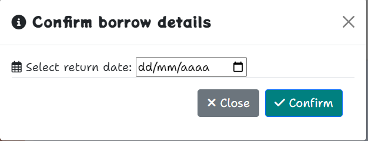
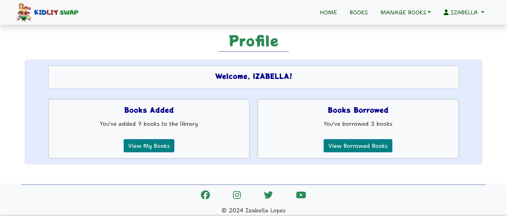

# KidLit Swap | Testing

[KidLit Swap Live Page](https://kidlit-swap-96ca222a1195.herokuapp.com/)

## CONTENTS

- [KidLit Swap | Testing](#kidlit-swap--testing)
  - [CONTENTS](#contents)
  - [User Story Testing](#user-story-testing)
    - [EPIC: Book Management System](#epic-book-management-system)
    - [EPIC: User Authentication](#epic-user-authentication)
  - [Site Administration](#site-administration)
  - [Validator Testing](#validator-testing)
    - [HTML](#html)
    - [CSS](#css)
    - [JavaScript](#javascript)
    - [Python](#python)
    - [Lighthouse](#lighthouse)
  - [Browser Testing](#browser-testing)
  - [Device Testing](#device-testing)
  - [Manual Testing](#manual-testing)
    - [Site Navigation](#site-navigation)
    - [Home Page](#home-page)
    - [Books Page](#books-page)
    - [Book Details Page](#book-details-page)
    - [My Books Page](#my-books-page)
    - [Edit Book Page](#edit-book-page)
    - [Delete Book Page](#delete-book-page)
    - [Borrowed Books Page](#borrowed-books-page)
    - [Add Book Page](#add-book-page)
    - [Profile Page](#profile-page)
    - [Django All Auth Pages](#django-all-auth-pages)
  - [Bugs](#bugs)
    - [Solved Bugs](#solved-bugs)
    - [Unsolved Bugs](#unsolved-bugs)

---

## User Story Testing

### [EPIC: Book Management System](https://github.com/IzabellaLopes/kidlit-swap/milestone/4)
*As a User / Admin I can add a new book to the system so that I can easily expand the library's collection*
  - There are various ways for users/admins to add new books on KidLit Swap.
  - The first method is on the homepage, when the user is logged in, where clicking the "Add Book" button redirects the user/admin to the "Add Book" page. 
  
  - Another method is accessing the "Book List," available for both logged-in and non-logged-in users. At the bottom of the page, there is another "Add Book" button that also redirects to the "Add Book" page.
  
  - All tests were conducted on the "Add Book" page, covering mandatory fields (title, author, description) and optional fields (image and category).
  

*As a User / Admin I can view a list of all books in the system so that I can easily manage and monitor the library's inventory*
- All tests conducted for this user story on KidLit Swap were successfully completed. 
- The books are displayed in alphabetical order, with available books appearing first, followed by borrowed books.
 
 
 
- This ensures a well-organized and user-friendly presentation of the library inventory for efficient management.

*As a User / Admin I can view details of a specific book so that I can get comprehensive information about a particular book*
- All tests for this user story were successfully completed on KidLit Swap. The Book Details page effectively displays comprehensive information about each book, including title, author, description, category, status, and the owner of the book (added by).
- Additionally, all tests were conducted successfully to ensure the correct display of these features:
    - Owner Message: Displays gratitude for sharing the book if the logged-in user is the owner, and the status is Available.
  

    - Borrow Button: Appears for users who are not the owner, with a "Borrow This Book" button when the status is Available.
  

    - Borrow Confirmation Modal: Allows users to confirm borrowing details, including selecting a return date, updating the book's status from Available to Borrowed.
  

    - Borrowed Message: The page includes a message for users who have borrowed the book, indicating the borrower's username and the expected return date.
  

- Finally, the "Back to Book List" button was tested and successfully redirects the user / admin to the Book List page.

*As a User / Admin I can edit the details of an existing book so that I can keep the information accurate and up-to-date*

- All tests were successfully conducted on KidLit Swap. The "Edit Book" page is opened when the book's owner clicks on "Edit" in Manage Books -> My Books -> Edit. 
- On the "Edit Book" page, the owner can modify details such as Title, Author, Description, Image, and Category. All functionalities were tested and approved.
  

*As a User / Admin I can mark a book as "Borrowed" and set a return date so that I can facilitate and track book borrowings*
- As previously demonstrated, a logged-in user, who is not the owner of the book, can request to borrow a book with an "Available" status by clicking the "Borrow" button. 
  
- All functionalities were thoroughly tested to ensure the following conditions: owners cannot request to borrow their own books, and non-logged-in users cannot request book borrowings.
- The "Borrow Confirmation Modal" was rigorously tested to allow only future dates, preventing the selection of retrospective dates.
  

*As a User / Admin I can mark a borrowed book as "Returned" so that I can update the library's inventory and track book returns*

- Return Book Button: At the bottom of each borrowed book card, a "Return Book" button with its respective Font Awesome icon is present.
  
- Return Confirmation: Clicking the "Return Book" button triggers a success message at the top of the page.
The success message states: "You have successfully returned the book 'TITLE OF THE BOOK.'"
  
- Testing was completed successfully, ensuring the seamless process of marking a returned book as "Available" on KidLit Swap.

### [EPIC: User Authentication](https://github.com/IzabellaLopes/kidlit-swap/milestone/5)
Django Allauth is installed and employed for implementing Sign Up, Log In, and Log Out functionalities.

*As a User I can log in so that I can access personalized features and participate in the KidLit Swap community*
- Access the Log In page.
- Enter valid credentials (username/email and password) and click the "Log In" button.
- Confirm successful login and redirection to the user's dashboard.
- Validate error messages for unsuccessful login attempts.

*As a User I can log out so that I can secure my account and maintain privacy*
- Click the "Log Out" option.
- Ensure a success message appears, confirming the user's logout.
- Validate error messages for any issues during the logout process.

*As a User I can sign up so that I can become a member of the KidLit Swap community and share my love for children's literature*
- Navigate to the Sign Up page.
- Input valid registration details and click the "Sign Up" button.
- Verify successful registration and redirection to the user's dashboard.

All testing was conducted using Django Allauth, ensuring seamless Sign Up, Log In, and Log Out functionalities. Success messages notify users of successful login and logout actions, while error messages provide feedback for unsuccessful attempts.

*As a User I can view and manage my added and borrowed books on my profile page so that I can easily track and organize my book-related activities*
- Welcome Section: 
  - Check that the user's username is correctly displayed in the welcome message.
- Books Added Section:
    - Verify that the message accurately reflects the number of books added by the user.
    - Confirm the functionality of the "View My Books" button.
- Books Borrowed Section:
  - Confirm that the message accurately reflects the number of books borrowed by the user.
    - Check the functionality of the "View Borrowed Books" button.
  

[Back to Contents](#contents)

---

## Site Administration

- Admins possess complete access to Create, Read, Update, and Delete (CRUD) functionalities for all books, categories, and users within the admin panel.

[Back to Contents](#contents)

---

## Validator Testing

### HTML

All HTML pages were run through the [W3C HTML Validator](https://validator.w3.org/). See results in below table.

| Page                 | Logged Out | Logged In |
|----------------------|------------|-----------|
| add_book.html        | N/A        | No errors |
| base.html            | No errors  | No errors |
| book_detail.html     | No errors  | No errors |
| books_list.html      | No errors  | No errors |
| borrowed_books.html  | N/A        | No errors |
| category_books.html  | No errors  | No errors |
| delete_book.html     | N/A        | No errors |
| edit_book.html       | N/A        | No errors |
| index.html           | No errors  | No errors |
| my_books.html        | N/A        | No errors |
| paginator.html       | No errors  | No errors |
| profile.html         | N/A        | No errors |
| login.html           | No errors  | N/A       |
| logout.html          | N/A        | No errors |
| signup.html          | No errors  | N/A       |
| 400.html             | No errors  | No errors |
| 403.html             | N/A        | No errors |
| 404.html             | No errors  | No errors |
| 500.html             | No errors  | No errors |

### CSS
No errors were detected upon validating my CSS file with the official [W3C CSS Validator](https://jigsaw.w3.org/css-validator/)

 

 
CSS

 

### JavaScript
No errors were detected upon validating my JavaScript through [JS Hint](https://jshint.com/) 

JS Hint

### Python
All Python files were run through [Code Institute Python Linter](https://pep8ci.herokuapp.com/#) and no errors were detected

admin.py

forms.py

models.py

urls.py

views.py

### Lighthouse

I conducted Lighthouse validation on all pages, including both mobile and desktop versions, to assess accessibility and performance. Initially, a warning was flagged regarding 'Background and foreground colors do not have a sufficient contrast ratio' in elements such as `nav-link`, `category button`, `Back to Book List button`, and the `Available and Borrowed status`. I addressed this issue by modifying the colors, referencing the [WebAIM Contrast Checker](https://webaim.org/resources/contrastchecker/), to achieve the recommended Contrast Ratio. Subsequently, I implemented style adjustments based on Lighthouse recommendations, resulting in the following improved scores.

| Page           | Performance  | Accessibility | Best Practices  | SEO |
|----------------|:------------:|:-------------:|:---------------:|:---:|
|                |              |               |                 |     |
| Desktop        |              |               |                 |     |
| Home           |           98 |           100 |             100 | 100 |
| Book List      |           98 |           100 |             100 | 100 |
| Book Details   |           99 |           100 |             100 | 100 |
| Books Category |           99 |           100 |             100 | 100 |
| My Books       |           98 |           100 |             100 | 100 |
| Borrowed Books |           99 |           100 |             100 | 100 |
| Add Book       |           99 |           100 |             100 | 100 |
| Edit Book      |           99 |           100 |             100 | 100 |
| Delete Book    |           99 |           100 |             100 | 100 |
| Profile        |           99 |           100 |             100 | 100 |
| Log in         |           99 |           100 |             100 | 100 |
| Log out        |           99 |           100 |             100 | 100 |
| Sign up        |           99 |           100 |             100 | 100 |
|                |              |               |                 |     |
| Mobile         |              |               |                 |     |
| Home           |           94 |           100 |             100 | 100 |
| Book List      |           94 |           100 |             100 | 100 |
| Book Details   |           93 |           100 |             100 | 100 |
| Books Category |           86 |           100 |             100 | 100 |
| My Books       |           94 |           100 |             100 | 100 |
| Borrowed Books |           95 |           100 |             100 | 100 |
| Add Book       |           95 |           100 |             100 | 100 |
| Edit Book      |           93 |           100 |             100 | 100 |
| Delete Book    |           94 |           100 |             100 | 100 |
| Profile        |           94 |           100 |             100 | 100 |
| Log in         |           95 |           100 |             100 | 100 |
| Log out        |           95 |           100 |             100 | 100 |
| Sign up        |           95 |           100 |             100 | 100 |

[Back to Contents](#contents)

---

## Browser Testing

- The KidLit Swap website was tested on Google Chrome, Firefox, and Safari browsers, with no issues noted.

[Back to Contents](#contents)

---

## Device Testing

- The KidLit Swap website was tested on a variety of devices, including Desktop, Laptop, iPhone 8, iPhone XR, and iPad, to ensure responsiveness across different screen sizes in both portrait and landscape modes. The website performed as intended, and the responsive design was checked using Chrome developer tools on multiple devices, maintaining structural integrity for various sizes.

[Back to Contents](#contents)

---

## Manual Testing

### Site Navigation

| Element               | Action     | Expected Result                                                    | Pass/Fail |
|-----------------------|------------|--------------------------------------------------------------------|-----------|
| NavBar                |            |                                                                    |           |
| Site Logo	            | Click      | Redirect to home                                                   | Pass      |
| Home Link             | Click      | Redirect to home                                                   | Pass      |
| Books Link	          | Click      | Open Books page	                                                  | Pass      |
| My Account Dropdown   | Click      | Open My Account dropdown                                           | Pass      |
| My Account Dropdown	  | Display    | Display dropdown with Sign Up and Log In when user is not in session| Pass      |
| Sign Up Link          | Click      | Open Sign Up page                                                  | Pass      |
| Sign Up Link          | Display    | Not visible if user in session                                     | Pass      |
| Log In Link           | Click      | Open Log In page                                                   | Pass      |
| Log In Link           | Display    | Not visible if user in session                                     | Pass      |
| Manage Books Dropdown | Click      | Open Manage Books dropdown                                         | Pass      |
| Manage Books Dropdown	| Display    | Display dropdown with My Books, Borrowed Books, and Add Book when user is in session| Pass      |
| My Books Link	        | Click	     | Open My Books page	                                                | Pass      |
| My Books Link         | Display    | Only visible if user in session                                    | Pass      |
| Borrowed Books Link	  | Click	     | Open Borrowed Books page	                                          | Pass      | 
| Borrowed Books Link   | Display    | Only visible if user in session                                    | Pass      |
| Add Book Link	        | Click	     | Open Add Book page	                                                | Pass      |
| Add Book Link         | Display    | Only visible if user in session                                    | Pass      |
| User Dropdown         | Click      | Open User dropdown                                                 | Pass      |
| User Dropdown	        | Display    | Display dropdown with Profile and Log out when user is in session  | Pass      | 
| Profile Link	        | Click	     | Open Profile page	                                                | Pass      | 
| Profile Link          | Display    | Only visible if user in session                                    | Pass      |
| Log Out Link          | Click      | Open log out confirm page                                          | Pass      |
| Log Out Link          | Display    | Only visible if user in session                                    | Pass      |
| All Nav Links         | Hover      | Color change to darkblue                                           | Pass      |
| All Nav Links         | Hover      | Zoom effect                                                        | Pass      |
| Home Link             | Active     | Blue box border                                                    | Pass      |
| Books Link            | Active     | Blue box border                                                    | Pass      |
|                       |            |                                                                    |           |
| Mobile View           |            |                                                                    |           |
| Hamburger Menu        | Responsive | Display when screen size reduces to medium size                    | Pass      |
| Site Logo	            | Click      | Redirect to home                                                   | Pass      |
| Home Link             | Click      | Redirect to home                                                   | Pass      |
| Books Link	          | Click      | Open Books page	                                                  | Pass      |
| My Account Dropdown   | Click      | Open My Account dropdown                                           | Pass      |
| My Account Dropdown	  | Display    | Display dropdown with Sign Up and Log In when user is not in session| Pass      |
| Sign Up Link          | Click      | Open Sign Up page                                                  | Pass      |
| Sign Up Link          | Display    | Not visible if user in session                                     | Pass      |
| Log In Link           | Click      | Open Log In page                                                   | Pass      |
| Log In Link           | Display    | Not visible if user in session                                     | Pass      |
| Manage Books Dropdown | Click      | Open Manage Books dropdown                                         | Pass      |
| Manage Books Dropdown	| Display    | Display dropdown with My Books, Borrowed Books, and Add Book when user is in session| Pass      |
| My Books Link	        | Click	     | Open My Books page	                                                | Pass      |
| My Books Link         | Display    | Only visible if user in session                                    | Pass      |
| Borrowed Books Link	  | Click	     | Open Borrowed Books page	                                          | Pass      | 
| Borrowed Books Link   | Display    | Only visible if user in session                                    | Pass      |
| Add Book Link	        | Click	     | Open Add Book page	                                                | Pass      |
| Add Book Link         | Display    | Only visible if user in session                                    | Pass      |
| User Dropdown         | Click      | Open User dropdown                                                 | Pass      |
| User Dropdown	        | Display    | Display dropdown with Profile and Log out when user is in session  | Pass      | 
| Profile Link	        | Click	     | Open Profile page	                                                | Pass      | 
| Profile Link          | Display    | Only visible if user in session                                    | Pass      |
| Log Out Link          | Click      | Open log out confirm page                                          | Pass      |
| Log Out Link          | Display    | Only visible if user in session                                    | Pass      |
| All Nav Links         | Hover      | Color change to darkblue                                           | Pass      |
| Home Link             | Active     | Blue box border                                                    | Pass      |
| Books Link            | Active     | Blue box border                                                    | Pass      |
|                       |            |                                                                    |           |
| Footer                |            |                                                                    |           |
| All links             | Click      | Open in new tab and to correct location                            | Pass      |
|                       |            |                                                                    |           |
| Responsive Design	| Check	| Confirm the responsiveness of the page on different screen sizes	| Pass |

 
### Home Page

| Element               | Action  | Expected Result                 | Pass/Fail |
|-----------------------|---------|---------------------------------|-----------|
| Hero 'Sign Up' Button | Click   | Open Sign up page               | Pass      |
| Hero 'Sign Up' Button | Display | Not visible if user in session  | Pass      |
| Hero 'Add Book" Button| Click   | Open Add Book page              | Pass      |
| Hero 'Add Book" Button| Display | Only visible if user in session | Pass      |
|                       |            |                                                                    |           |
| Responsive Design	| Check	| Confirm the responsiveness of the page on different screen sizes	| Pass |

### Books Page

| Element            | Action        | Expected Result                                        | Pass/Fail |
|--------------------|---------------|--------------------------------------------------------|-----------|
| Category Dropdown  | Click         | Display dropdown with available categories	            | Pass      |
| Category Dropdown	 | Display       | Contains a list of available categories                | Pass      |
| Category Dropdown	 | Hover         | Text color changes to light-grey       	              | Pass      |
| Category Dropdown	 | Hover         | Background color changes to green      	              | Pass      |
| Category Dropdown	 | Hover         | Border color changes to dark-green       	            | Pass      |
| Book Cards         | Click	       | Redirect to the detailed page of the book	            | Pass      |
| Book Cards	       | Order	       | Displayed in alphabetical order based on book titles	  | Pass      |
| Book Cards	       | Order	       | Available books displayed first, followed by Borrowed books | Pass |
| Book Cards         | Hover         | Zoom effect                                            | Pass      |
| Book Image	       | Display	     | Show book image	                                      | Pass      |
| Book Title	       | Display	     | Show the title of the book	                            | Pass      |
| Author	           | Display	     | Show the author of the book	                          | Pass      |
| Book Status	       | Display	     | Show the status of the book (Available/Borrowed)	      | Pass      |
| Added by	         | Display	     | Show the username of the user who added the book	      | Pass      |
| Paginator	         | Click	       | Navigate to other pages	                              | Pass      |
| Paginator	         | Display	     | Show pagination links	                                | Pass      |
| Add Book Button    | Click	       | Open the Add Book page                                 | Pass      |
| Add Book Button	   | Display	     | Visible, encouraging users to add a book	              | Pass      |
|                       |            |                                                                    |           |
| Responsive Design	| Check	| Confirm the responsiveness of the page on different screen sizes	| Pass |

### Book Details Page

| Element            | Action        | Expected Result                                        | Pass/Fail |
|--------------------|---------------|--------------------------------------------------------|-----------|
| Book Image	       | Display	     | Show the image of the book	                            | Pass      |
| Book Title	       | Display	     | Show the title of the book	                            | Pass      |
| Author	           | Display	     | Show the author of the book	                          | Pass      |
| Description	       | Display	     | Show the description of the book	                      | Pass      |
| Category	         | Display	     | Show the category of the book	                        | Pass      |
| Book Status	       | Display	     | Show the status of the book (Available/Borrowed)     	| Pass      |
| Added by	         | Display	     | Show the username of the user who added the book	      | Pass      |
| Log In Prompt      | Click	       | Redirect to the login page	                            | Pass      |
| Log In Prompt      | Display	     | Visible only if the book is available and user is not authenticated	| Pass      |
| Log In Button      | Click	       | Redirect to the login page	                            | Pass      |          
| Log In Button 	   | Display	     | Visible only if the book is available and user is not authenticated	| Pass      |
| Borrow This Book Button | Click	   | Open a modal to confirm borrowing details	            | Pass      |
| Borrow This Book Button | Display	 | Visible only if the book is available and user is authenticated	| Pass      |
| Borrow This Book Button | Hover	   | Background color changes to navy-blue	                | Pass      |
| Borrowed Book Message	| Display	   | Show a message if the book is currently borrowed	      | Pass      |
| Back to Book List	 | Click	       | Redirect to the Book List page	                        | Pass      |
| Back to Book List	 | Display	     | Visible as a button to go back to the Book List page	  | Pass      |
| Back to Book List	 | Hover         | Text color changes to light-grey       	              | Pass      |
| Back to Book List	 | Hover         | Background color changes to green      	              | Pass      |
| Back to Book List	 | Hover         | Border color changes to dark-green       	            | Pass      |
| Modal	             | Close         | Close the modal when "Close" button is clicked       	| Pass      |
| Modal	             | Confirm	     | Submit the borrow details form and close the modal    	| Pass      |
| Modal Confirm Button | Hover	     | Background color changes to navy-blue	                | Pass      |
| Modal Confirm Button | Click       | Success message appears informing 'You have successfully borrowed the book "title of the book" | Pass      |
| Modal Confirm Button | Click       | Success message fades after 3 seconds                   | Pass      |
|                       |            |                                                                    |           |
| Responsive Design	| Check	| Confirm the responsiveness of the page on different screen sizes	| Pass |

### My Books Page

| Element            | Action        | Expected Result                                        | Pass/Fail |
|--------------------|---------------|--------------------------------------------------------|-----------|
| User Authentication| Check         | Visible only when the user is authenticated            | Pass      |
| "Added Books" Section	| Display	   | Show a title "Added Books"	                            | Pass      |
| Book Cards	       | Display	     | Show cards for each book added by the authenticated user | Pass    |
| Book Cards	       | Order	       | Displayed in alphabetical order based on book titles	  | Pass      |
| Book Cards         | Hover         | Zoom effect                                            | Pass      |
| Book Image	       | Display	     | Show the image of the book on each card	              | Pass      |
| Book Title	       | Display	     | Show the title of the book on each card	              | Pass      |
| Author	           | Display	     | Show the author of the book on each card	              | Pass      |
| Book Status	       | Display       | Show the status of the book (Available/Borrowed) on each card | Pass  |
| "View Details" Button	| Click	     | Redirect to the Book Details page for the selected book| Pass      |
| "View Details" Button	| Display	   | Visible on each card for the authenticated user	      | Pass      |
| "View Details" Button	| Hover	     | Background color changes to navy-blue on hover	        | Pass      |
| "Edit" Button	     | Click	       | Redirect to the Edit Book page for the selected book	  | Pass      |
| "Edit" Button	     | Display	     | Visible on each card for the authenticated user	      | Pass      |
| "Edit" Button	     | Hover	       | Background color changes to secondary color on hover 	| Pass      |
| "Delete" Button    | Click         | Redirect to the Delete Book page for the selected book	| Pass      |
| "Delete" Button	   | Display	     | Visible on each card for the authenticated user	      | Pass      |
| "Delete" Button	   | Hover	       | Background color changes to dark-red on hover	        | Pass      |
|                       |            |                                                                    |           |
| Responsive Design	| Check	| Confirm the responsiveness of the page on different screen sizes	| Pass |
|                    |               |                                                        |           |
| Non-authenticated User |
| Book Cards	| Display	| No cards displayed when the user is not authenticated	| Pass      |
| Log In Prompt	| Display	| Display a prompt to log in when the user is not authenticated	| Pass      |
| "Log In" Button	| Click	| Redirect to the log in page when clicked	| Pass      |

### Edit Book Page

| Element            | Action        | Expected Result                                        | Pass/Fail |
|--------------------|---------------|--------------------------------------------------------|-----------|
| Page Title         | Display |	Show the title "Edit Book" at the top of the page	| Pass |
| Form Inputs	| Display	| Display form inputs for Title, Author, Description, Image, Category, and New Category	| Pass |
| Title Input	| Fill	| Enter a valid book title	| Pass |
| Author Input	| Fill	| Enter a valid author name	| Pass |
| Description Input	| Fill	| Enter a valid book description	| Pass |
| Image Input	| Upload	| Upload a valid image file	| Pass |
| Image Input (Optional)	| Skip	| Form can be submitted without uploading an image, in which case a placeholder image is used	| Pass |
| Image Upload Handling	| Cloudinary	| If an image is uploaded, it is stored on Cloudinary; if not, the placeholder image is used	| Pass |
| Category Input	| Select	| Choose a category from the provided options	| Pass |
| New Category Input	| Fill	| Enter a new category if selected "New Category"	| Pass |
| New Category Input	| Optional	| Submit form without filling New Category, if not selected	| Pass |
| Save Changes Button	| Click	| Submit the form with valid inputs	| Pass |
| Submission	| Success	| Redirect to the My Books page for the newly edited book	| Pass |
| Submission Redirect	| Check	| Confirm redirection to the My Books page for the edited book	| Pass |
| Authentication	| Check	| Form and functionality only available when the user is authenticated	| Pass |
| Authentication Prompt	| Check	| Redirect to log in page if the user is not authenticated	| Pass |
| Authentication Prompt	| Display	| Visible only when the user is not authenticated	| Pass
| Authentication Prompt	| Click	| Redirect to log in page when clicked	| Pass |
| Validation input	| Display	| Show error messages for invalid inputs	| Pass | 
| Validation input	| Correct Error	| Correctly display error messages for invalid inputs	| Pass | 
| New Category Input	| Optional	| Submit form without filling New Category, if not selected	| Pass | 
| New Category Input	| Fill Optional	| Submit form with filling New Category, if selected	| Pass | 
| New Category Input	| Category Added	| Confirm the addition of a new category in the system	| Pass | 
| Save Changes Button	| Click	| Save the modifications made to the book details	| Pass | 
| Save Changes Button	| Display	| Visible and accessible on the page	| Pass | 
| Save Changes Button	| Redirect	| Redirect to the My Books page | Pass | 
| Save Changes Button	| Success	| Show a success message confirming the changes	| Pass | 
| Save Changes Button	| Hover	| Background color changes to navy-blue |	Pass |
| Save Changes Button	|Click	| Successfully saves changes and redirects to My Books page | Pass |
|                       |            |                                                                    |           |
| Responsive Design	| Check	| Confirm the responsiveness of the page on different screen sizes	| Pass |

### Delete Book Page

| Element            | Action        | Expected Result                                        | Pass/Fail |
|--------------------|---------------|--------------------------------------------------------|-----------|
| Page Title         | Display |	Show the title "Delete Book" at the top of the page	| Pass |
| Authentication	| Check	| Functionality only available when the user is authenticated	and is the owner of the book | Pass |
| Authentication Prompt	| Check	| Redirect to log in page if the user is not authenticated	| Pass |
| Authentication Prompt	| Display	| Visible only when the user is not authenticated	| Pass
| Authentication Prompt	| Click	| Redirect to log in page when clicked	| Pass |
| Delete Confirmation	| Display	| Show a confirmation message to delete the book | Pass | 
| Delete Button	| Click	| Delete the book and redirect to My Books page |	Pass | 
| Cancel Button	| Click	| Redirect to My Books page without deletion | Pass | 
| Unauthorized User	| Display	| Show an error message if the user can't delete | 	Pass | 
| Unauthorized User	| Redirect	| Redirect to My Books with error message | 	Pass | 
| User Authorized	| Display | Successfully delete the book if available | 	Pass | 
| Borrowed Book	| Display | Prevent deletion and show error message	| Pass |
|                       |            |                                                                    |           |
| Responsive Design	| Check	| Confirm the responsiveness of the page on different screen sizes	| Pass |

*Note: Deletion is only allowed if the user is the owner of the book and the book is available. If the book is borrowed, deletion is not allowed, and an error message is displayed.*

### Borrowed Books Page

| Element            | Action        | Expected Result                                        | Pass/Fail |
|--------------------|---------------|--------------------------------------------------------|-----------|
| Page Title         | Display |	Show the title "Borrowed Books" at the top of the page	| Pass |
| Authentication	| Check	| Functionality only available when the user is authenticated | Pass |
| Authentication Prompt	| Check	| Redirect to log in page if the user is not authenticated	| Pass |
| Authentication Prompt	| Display	| Visible only when the user is not authenticated	| Pass
| Authentication Prompt	| Click	| Redirect to log in page when clicked	| Pass |
| | | | |
| No Borrowed Books	| Display | Show a message if the user has no borrowed books |	Pass |
| Do you want to borrow a book Button	| Display | Only display if the user has no borrowed books |	Pass |
| Do you want to borrow a book Button	| Click | Redirect to Book list page |	Pass |
| Do you want to borrow a book Button	| Redirect | Redirect to Book list page |	Pass |
| Do you want to borrow a book Button	| Hover | Background color changes to navy-blue |	Pass |
| | | | |
| User Borrowed Books	| Display	| Display a list of books borrowed by the user | Pass |
| Book Cards         | Hover         | Zoom effect                                            | Pass      |
| Book Card	| Display	| Show each borrowed book with its details |	Pass |
| Book Image	| Display	| Show the image of the borrowed book |	Pass | 
| Book Title	| Display	| Show the title of the borrowed book | Pass | 
| Owner	| Display	| Show the username of the book owner | Pass | 
| Return Date	| Display	| Show the return date of the borrowed book | Pass | 
| Return Book Button |	Display	 | Visible only for borrowed books |	Pass |
| Return Book Button	| Click	| Return the book. Book status changes from Borrowed to Available. Redirect to Borrowed Books page | Pass |
| Return Book Button	| Redirect	| Redirect to Borrowed Books page | Pass |
| Return Book Button	| Hover	| Background color changes to green |	Pass |
|                       |            |                                                                    |           |
| Responsive Design	| Check	| Confirm the responsiveness of the page on different screen sizes	| Pass |

### Add Book Page

| Element            | Action        | Expected Result                                        | Pass/Fail |
|--------------------|---------------|--------------------------------------------------------|-----------|
| Page Title         | Display |	Show the title "Add Book" at the top of the page	| Pass |
| Form Inputs	| Display	| Display form inputs for Title, Author, Description, Image, Category, and Do you want to add a new Category	| Pass |
| Title Input	| Fill	| Enter a valid book title	| Pass |
| Author Input	| Fill	| Enter a valid author name	| Pass |
| Description Input	| Fill	| Enter a valid book description	| Pass |
| Image Input	| Upload	| Upload a valid image file	| Pass |
| Image Input (Optional)	| Skip	| Form can be submitted without uploading an image, in which case a placeholder image is used	| Pass |
| Image Upload Handling	| Cloudinary	| If an image is uploaded, it is stored on Cloudinary; if not, the placeholder image is used	| Pass |
| Category Input	| Select	| Choose a category from the provided options	| Pass |
| Do you want to add a new Category Input	| Fill	| Enter a new category if selected "Do you want to add a new Category?"	| Pass |
| Do you want to add a new Category Input	| Optional	| Submit form without filling Do you want to add a new Category, if not selected	| Pass |
| Add Book Button	| Click	| Submit the form with valid inputs	| Pass |
| Submission	| Success	| Redirect to the Book List page for the newly added book	| Pass |
| Submission Redirect	| Check	| Confirm redirection to the Book List page for the added book	| Pass |
| Authentication	| Check	| Form and functionality only available when the user is authenticated	| Pass |
| Authentication Prompt	| Check	| Redirect to log in page if the user is not authenticated	| Pass |
| Authentication Prompt	| Display	| Visible only when the user is not authenticated	| Pass
| Authentication Prompt	| Click	| Redirect to log in page when clicked	| Pass |
| Validation input	| Display	| Show error messages for invalid inputs	| Pass | 
| Validation input	| Correct Error	| Correctly display error messages for invalid inputs	| Pass | 
| Do you want to add a new Category Input	| Optional	| Submit form without filling New Category, if not selected	| Pass | 
| Do you want to add a new Category Input	| Fill Optional	| Submit form with filling New Category, if selected	| Pass | 
| Do you want to add a new Category Input	| Category Added	| Confirm the addition of a new category in the system	| Pass | 
| Add Book Button	| Click	| Save the details of the new book		| Pass | 
| Add Book Button	| Display	| Visible and accessible on the page	| Pass | 
| Add Book Button	| Redirect	| Redirect to the Book List page | Pass | 
| Add Book Button	| Success	| Show a success message confirming the addition		| Pass | 
| Add Book Button	| Hover	| Background color changes to navy-blue |	Pass |
| Add Book Button	| Click	| Successfully add a new book and redirects to Book List page | Pass |
|                       |            |                                                                    |           |
| Responsive Design	| Check	| Confirm the responsiveness of the page on different screen sizes	| Pass |

### Profile Page

| Element            | Action        | Expected Result                                        | Pass/Fail |
|--------------------|---------------|--------------------------------------------------------|-----------|
| Page Title         | Display |	Show the title "Profile" at the top of the page	| Pass |
| Welcome User	| Display	| Display a welcome message addressing the user by their username	| Pass | 
| Books Added Card	| Display	| Show a card with the title "Books Added"	| Pass | 
| Books Added Card	| Hover	| Zoom effect 	| Pass | 
| Books Added Count	| Display	| Display the count of books added by the user	| Pass | 
| Books Added Count (Zero)	|  Display	| Display "0 books" if the user hasn't added any books	| Pass | 
| View My Books Button	| Click	| Redirect to the My Books page	| Pass | 
| View My Books Button	| Redirect	| Redirect to the My Books page	| Pass |
| View My Books Button	| Hover	| Background color changes to navy-blue	| Pass | 
| Books Borrowed Card	| Display	| Show a card with the title "Books Borrowed"	| Pass | 
| Books Borrowed Card	| Hover	| Zoom effect 	| Pass |
| Books Borrowed Count	| Display	| Display the count of books borrowed by the user	| Pass | 
| Books Borrowed Count (Zero)	| Display	| Display "0 books" if the user hasn't borrowed any books	| Pass | 
| View Borrowed Books Button	| Click	| Redirect to the Borrowed Books page	| Pass | 
| View Borrowed Books Button	| Redirect	| Redirect to the Borrowed Books page	| Pass | 
| Cards Container	| Display	| Show a rounded container for the cards	| Pass | 
| Authentication	| Check	| Profile page accessible only when the user is authenticated	| Pass | 
| Authentication Prompt	| Check	| Redirect to log in page if the user is not authenticated	| Pass | 
| Authentication Prompt	| Display	| Visible only when the user is not authenticated	| Pass | 
| Authentication Prompt	| Click	| Redirect to log in page when clicked	| Pass | 
|                       |            |                                                                    |           |
| Responsive Design	| Check	| Confirm the responsiveness of the page on different screen sizes	| Pass |

### Django All Auth Pages

| Element                    | Action                                    | Expected Result                            | Pass/Fail |
|----------------------------|-------------------------------------------|--------------------------------------------|-----------|
| Sign Up                    |                                           |                                            |           |
| Page Title         | Display |	Show the title "Sign Up" at the top of the page	| Pass |
| Have an account? Log in        | Display |	Display Have an account? Log in (link)	| Pass |
| Log in link               | Click                                     | Redirect to Log in page                     | Pass      |
| Username field             | Leave empty                               | On submit: form won't submit               | Pass      |
| Username field             | Leave empty                               | Error message displays                     | Pass      |
| Username field             | Insert correct format                     | On submit: form submit                     | Pass      |
| Username field             | Insert duplicate username                 | On submit: form won't submit               | Pass      |
| Username field             | Insert duplicate username                 | Error message displays                     | Pass      |
| Email field                | Insert incorrect format                   | On submit: form won't submit               | Pass      |
| Email field                | Insert incorrect format                   | Error message displays                     | Pass      |
| Email field                | Insert correct format                     | On submit: form submit                     | Pass      |
| Email field                | Leave empty                               | On submit: form submit                     | Pass      |
| Email field                | Insert duplicate email                    | On submit: form won't submit               | Pass      |
| Email field                | Insert duplicate email                    | Error message displays                     | Pass      |
| Password field             | Insert incorrect format                   | On submit: form won't submit               | Pass      |
| Password field             | Insert incorrect format                   | Error message displays                     | Pass      |
| Password field             | Passwords don't match                     | On submit: form won't submit               | Pass      |
| Password field             | Passwords don't match                     | Error message displays                     | Pass      |
| Password field             | Insert correct format and passwords match | On submit: form submit                     | Pass      |
| Sign Up button(form valid) | Click                                     | Form submit                                | Pass      |
| Sign Up button(form valid) | Click                                     | Redirect to home page                      | Pass      |
| Sign Up button(form valid) | Click                                     | Success message confirming login appears   | Pass      |
| Sign Up button(form valid) | Click                                     | Success message fades after 3 seconds      | Pass      |
|                            |                                           |                                            |           |
| Log in                     |                                           |                                            |           |
| Page Title         | Display |	Show the title "Log In" at the top of the page	| Pass |
| Welcome to KidLit Swap! Don't have an account? Sign up  | Display |	Display Welcome to KidLit Swap! Don't have an account? Sign up (link)	| Pass |
| Sign up link               | Click                                     | Redirect to sign up page                   | Pass      |
| Username field             | Leave empty                               | On submit: form won't submit               | Pass      |
| Username field             | Leave empty                               | Error message displays                     | Pass      |
| Username field             | Insert wrong username                     | On submit: form won't submit               | Pass      |
| Username field             | Insert wrong username                     | Error message displays                     | Pass      |
| Password field             | Leave empty                               | On submit: form won't submit               | Pass      |
| Password field             | Leave empty                               | Error message displays                     | Pass      |
| Password field             | Insert wrong password                     | On submit: form won't submit               | Pass      |
| Password field             | Insert wrong password                     | Error message displays                     | Pass      |
| Login button(form valid)   | Click                                     | Form submit                                | Pass      |
| Login button(form valid)   | Click                                     | Redirect to home page                      | Pass      |
| Login button(form valid)   | Click                                     | Success message confirming login appears   | Pass      |
| Login button(form valid)   | Click                                     | Success message fades after 3 seconds      | Pass      |
|                            |                                           |                                            |           |
| Log Out Confirmation       |                                           |                                            |           |
| Page Title         | Display |	Show the title "Log Out" at the top of the page	| Pass |
| Log Out button              | Click                                     | Redirect to homepage                       | Pass      |
| Log Out button              | Click                                     | Success message confirming log out appears | Pass      |
| Log Out button              | Click                                     | Success message fades after 3 seconds      | Pass      |
| Cancel button | Click | Redirect to homepage                       | Pass      |
|                       |            |                                                                    |           |
| Responsive Design	| Check	| Confirm the responsiveness of the page on different screen sizes	| Pass |

[Back to Contents](#contents)

---

## Bugs 

### Solved Bugs

| **BUG** | **DESCRIBE THE BUG**  | **HOW I SOLVED**|
| ------- | ------- | ------- |
| A glitch in the borrowing system allowed users to request borrowings for past dates | Users could request borrowings for dates in the past due to a logic flaw in the system | Resolved the bug by adding min="" to the returnDate input in borrow_book.html |
| Login errors were not displaying properly | The issue arose when login errors were not being presented appropriately to users. The error messages were not clearly visible | To address this bug, I modified the login error display in the HTML template. The revised code now ensures that login errors are prominently shown in a container with an alert style. This enhancement offers users a clearer understanding of any issues during the login process. The solution involves using Bootstrap's alert component and iterating through login errors to present them individually in a more readable format |
| Navbar items not consistently indicating active state		| The active state styling for 'Home' and 'Books' in the navbar was missing a blue box, resulting in a less visually clear navigation experience	| Implemented a JavaScript script in the HTML template that dynamically adds the 'nav-active' class to the closest parent 'nav-item' based on the URL. This script enhances the styling, providing a clear indication of the active navigation item |

### Unsolved Bugs

No unsolved bugs reported in the project

[Back to Contents](#contents)

---