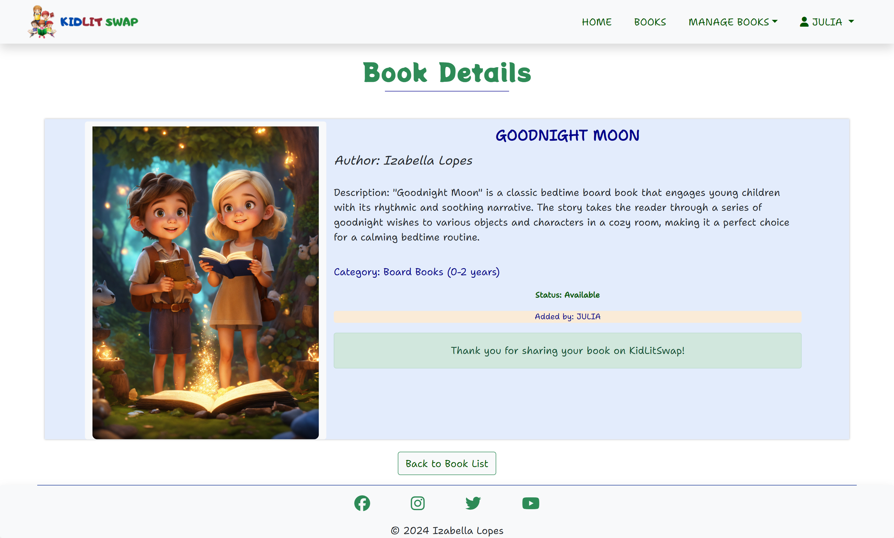
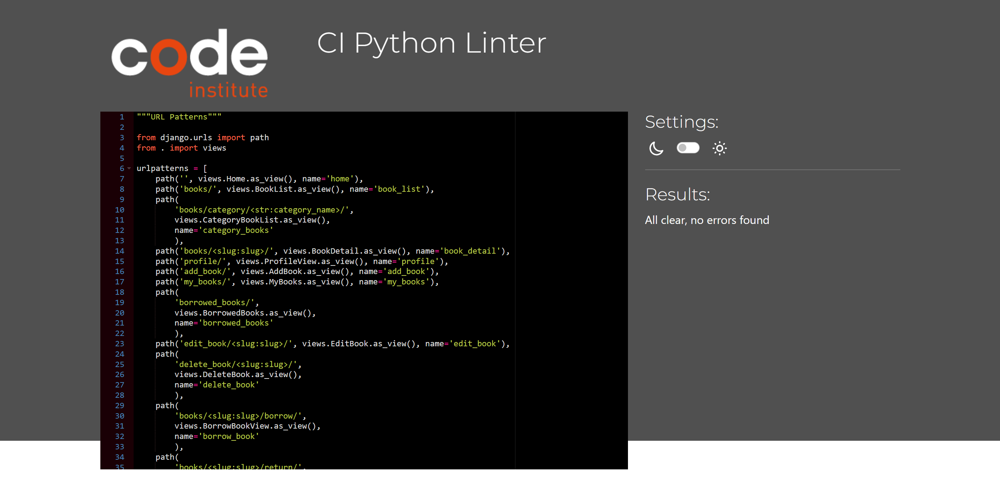

# KidLit Swap

[KidLit Swap Live Page](https://kidlit-swap-96ca222a1195.herokuapp.com/)

## CONTENTS

- [KidLit Swap](#kidlit-swap)
  - [CONTENTS](#contents)
  - [User Story Testing](#user-story-testing)
    - [EPIC: Book Management System](#epic-book-management-system)
    - [EPIC: User Authentication](#epic-user-authentication)
  - [Site Administration](#site-administration)
  - [Validator Testing](#validator-testing)
    - [HTML](#html)
    - [CSS](#css)
    - [JavaScript](#javascript)
    - [Python](#python)
    - [Lighthouse](#lighthouse)
  - [Browser Testing](#browser-testing)
  - [Device Testing](#device-testing)

---

## User Story Testing

### [EPIC: Book Management System](https://github.com/IzabellaLopes/kidlit-swap/milestone/4)
*As a User / Admin I can add a new book to the system so that I can easily expand the library's collection*
  - There are various ways for users/admins to add new books on KidLit Swap.
  - The first method is on the homepage, when the user is logged in, where clicking the "Add Book" button redirects the user/admin to the "Add Book" page. 
  
  - Another method is accessing the "Book List," available for both logged-in and non-logged-in users. At the bottom of the page, there is another "Add Book" button that also redirects to the "Add Book" page.
  
  - All tests were conducted on the "Add Book" page, covering mandatory fields (title, author, description) and optional fields (image and category).
  

*As a User / Admin I can view a list of all books in the system so that I can easily manage and monitor the library's inventory*
- All tests conducted for this user story on KidLit Swap were successfully completed. 
- The books are displayed in alphabetical order, with available books appearing first, followed by borrowed books.
 
 
- This ensures a well-organized and user-friendly presentation of the library inventory for efficient management.

*As a User / Admin I can view details of a specific book so that I can get comprehensive information about a particular book*
- All tests for this user story were successfully completed on KidLit Swap. The Book Details page effectively displays comprehensive information about each book, including title, author, description, category, status, and the owner of the book (added by).
- Additionally, all tests were conducted successfully to ensure the correct display of these features:
    - Owner Message: Displays gratitude for sharing the book if the logged-in user is the owner, and the status is Available.
  

    - Borrow Button: Appears for users who are not the owner, with a "Borrow This Book" button when the status is Available.
  

    - Borrow Confirmation Modal: Allows users to confirm borrowing details, including selecting a return date, updating the book's status from Available to Borrowed.
  

    - Borrowed Message: The page includes a message for users who have borrowed the book, indicating the borrower's username and the expected return date.
  

- Finally, the "Back to Book List" button was tested and successfully redirects the user / admin to the Book List page.

*As a User / Admin I can edit the details of an existing book so that I can keep the information accurate and up-to-date*

- All tests were successfully conducted on KidLit Swap. The "Edit Book" page is opened when the book's owner clicks on "Edit" in Manage Books -> My Books -> Edit. 
- On the "Edit Book" page, the owner can modify details such as Title, Author, Description, Image, and Category. All functionalities were tested and approved.
  

*As a User / Admin I can mark a book as "Borrowed" and set a return date so that I can facilitate and track book borrowings*
- As previously demonstrated, a logged-in user, who is not the owner of the book, can request to borrow a book with an "Available" status by clicking the "Borrow" button. 
  
- All functionalities were thoroughly tested to ensure the following conditions: owners cannot request to borrow their own books, and non-logged-in users cannot request book borrowings.
- The "Borrow Confirmation Modal" was rigorously tested to allow only future dates, preventing the selection of retrospective dates.
  

*As a User / Admin I can mark a borrowed book as "Returned" so that I can update the library's inventory and track book returns*

- Return Book Button: At the bottom of each borrowed book card, a "Return Book" button with its respective Font Awesome icon is present.
  
- Return Confirmation: Clicking the "Return Book" button triggers a success message at the top of the page.
The success message states: "You have successfully returned the book 'TITLE OF THE BOOK.'"
  
- Testing was completed successfully, ensuring the seamless process of marking a returned book as "Available" on KidLit Swap.

### [EPIC: User Authentication](https://github.com/IzabellaLopes/kidlit-swap/milestone/5)
Django Allauth is installed and employed for implementing Sign Up, Log In, and Log Out functionalities.

*As a User I can log in so that I can access personalized features and participate in the KidLit Swap community*
- Access the Log In page.
- Enter valid credentials (username/email and password) and click the "Log In" button.
- Confirm successful login and redirection to the user's dashboard.
- Validate error messages for unsuccessful login attempts.

*As a User I can log out so that I can secure my account and maintain privacy*
- Click the "Log Out" option.
- Ensure a success message appears, confirming the user's logout.
- Validate error messages for any issues during the logout process.

*As a User I can sign up so that I can become a member of the KidLit Swap community and share my love for children's literature*
- Navigate to the Sign Up page.
- Input valid registration details and click the "Sign Up" button.
- Verify successful registration and redirection to the user's dashboard.

All testing was conducted using Django Allauth, ensuring seamless Sign Up, Log In, and Log Out functionalities. Success messages notify users of successful login and logout actions, while error messages provide feedback for unsuccessful attempts.

*As a User I can view and manage my added and borrowed books on my profile page so that I can easily track and organize my book-related activities*
- Welcome Section: 
  - Check that the user's username is correctly displayed in the welcome message.
- Books Added Section:
    - Verify that the message accurately reflects the number of books added by the user.
    - Confirm the functionality of the "View My Books" button.
- Books Borrowed Section:
  - Confirm that the message accurately reflects the number of books borrowed by the user.
    - Check the functionality of the "View Borrowed Books" button.
  

[Back to Contents](#contents)

---

## Site Administration

- Admins possess complete access to Create, Read, Update, and Delete (CRUD) functionalities for all books, categories, and users within the admin panel.

[Back to Contents](#contents)

---

## Validator Testing

### HTML

All HTML pages were run through the [W3C HTML Validator](https://validator.w3.org/). See results in below table.

| Page                 | Logged Out | Logged In |
|----------------------|------------|-----------|
| add_book.html        | N/A        | No errors |
| base.html            | No errors  | No errors |
| book_detail.html     | No errors  | No errors |
| books_list.html      | No errors  | No errors |
| borrowed_books.html  | N/A        | No errors |
| category_books.html  | No errors  | No errors |
| delete_book.html     | N/A        | No errors |
| edit_book.html       | N/A        | No errors |
| index.html           | No errors  | No errors |
| my_books.html        | N/A        | No errors |
| paginator.html       | No errors  | No errors |
| profile.html         | N/A        | No errors |
| login.html           | No errors  | N/A       |
| logout.html          | N/A        | No errors |
| signup.html          | No errors  | N/A       |
| 400.html             | No errors  | No errors |
| 403.html             | N/A        | No errors |
| 404.html             | No errors  | No errors |
| 500.html             | No errors  | No errors |

### CSS
No errors were detected upon validating my CSS file with the official [W3C CSS Validator](https://jigsaw.w3.org/css-validator/)

 

 
CSS

 

### JavaScript
No errors were detected upon validating my JavaScript through [JS Hint](https://jshint.com/) 

JS Hint

### Python
All Python files were run through [Code Institute Python Linter](https://pep8ci.herokuapp.com/#) and no errors were detected

admin.py

forms.py

models.py

urls.py

views.py

### Lighthouse

I conducted Lighthouse validation on all pages, including both mobile and desktop versions, to assess accessibility and performance. Initially, a warning was flagged regarding 'Background and foreground colors do not have a sufficient contrast ratio' in elements such as `nav-link`, `category button`, `Back to Book List button`, and the `Available and Borrowed status`. I addressed this issue by modifying the colors, referencing the [WebAIM Contrast Checker](https://webaim.org/resources/contrastchecker/), to achieve the recommended Contrast Ratio. Subsequently, I implemented style adjustments based on Lighthouse recommendations, resulting in the following improved scores.

| Page           | Performance  | Accessibility | Best Practices  | SEO |
|----------------|:------------:|:-------------:|:---------------:|:---:|
|                |              |               |                 |     |
| Desktop        |              |               |                 |     |
| Home           |          100 |           100 |             100 | 100 |
| Book List      |           98 |           100 |             100 | 100 |
| Book Details   |           99 |            99 |             100 | 100 |
| Books Category |           99 |            98 |             100 | 100 |
| My Books       |           98 |           100 |             100 | 100 |
| Borrowed Books |           99 |           100 |             100 | 100 |
| Add Book       |           99 |           100 |             100 | 100 |
| Edit Book      |           99 |            98 |             100 | 100 |
| Delete Book    |           99 |           100 |             100 | 100 |
| Profile        |           99 |           100 |             100 | 100 |
| Log in         |           99 |           100 |             100 | 100 |
| Log out        |           99 |           100 |             100 | 100 |
| Sign up        |           99 |           100 |             100 | 100 |
|                |              |               |                 |     |
| Mobile         |              |               |                 |     |
| Home           |           94 |           100 |             100 | 100 |
| Book List      |           94 |           100 |             100 | 100 |
| Book Details   |           93 |            98 |             100 | 100 |
| Books Category |           86 |            98 |             100 | 100 |
| My Books       |           94 |           100 |             100 | 100 |
| Borrowed Books |           95 |           100 |             100 | 100 |
| Add Book       |           95 |           100 |             100 | 100 |
| Edit Book      |           93 |            98 |             100 | 100 |
| Delete Book    |           94 |           100 |             100 | 100 |
| Profile        |           94 |           100 |             100 | 100 |
| Log in         |           95 |           100 |             100 | 100 |
| Log out        |           95 |           100 |             100 | 100 |
| Sign up        |           95 |           100 |             100 | 100 |

## Browser Testing

- The KidLit Swap website was tested on Google Chrome, Firefox, and Safari browsers, with no issues noted.

## Device Testing

- The KidLit Swap website was tested on a variety of devices, including Desktop, Laptop, iPhone 8, iPhone XR, and iPad, to ensure responsiveness across different screen sizes in both portrait and landscape modes. The website performed as intended, and the responsive design was checked using Chrome developer tools on multiple devices, maintaining structural integrity for various sizes.

 

   